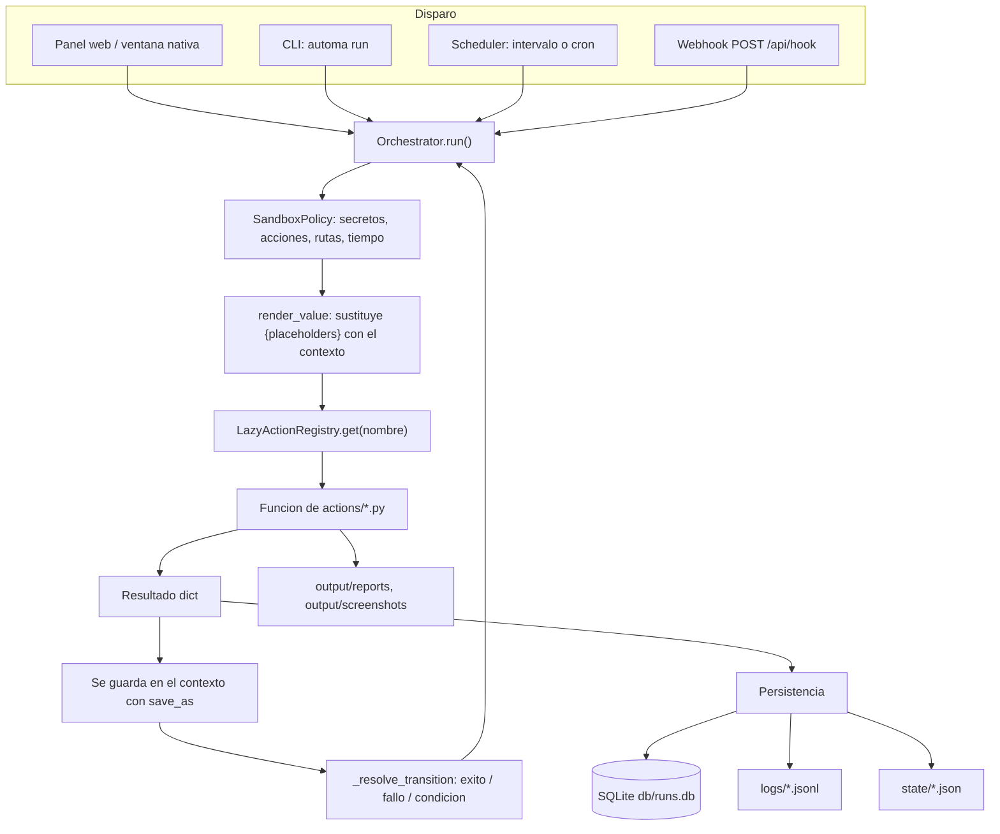
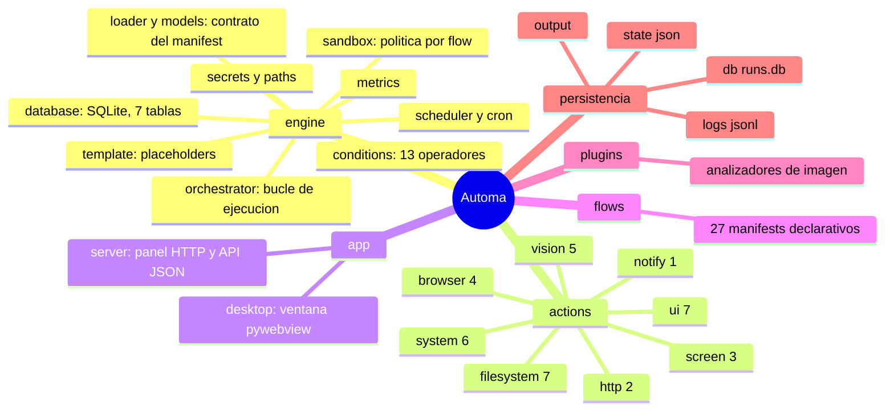

# 01 · Descripción general del sistema

> Qué es Automa, qué problema resuelve, quién lo usa, qué entra y qué sale.
> Al final hay una sección escrita para alguien sin formación técnica.

---

## 1. Qué es

**Automa es un orquestador local de automatización (RPA) para el escritorio Windows.**

Cada tarea automatizable se describe en un archivo JSON llamado *manifest*
(`flows/<carpeta>/manifest.json`). Ese archivo declara una lista de pasos, cada paso
invoca una **acción** con nombre (`screen.capture_screenshot`, `browser.fill_form`,
`system.run_powershell`…), y opcionalmente declara condiciones, reintentos y transiciones
entre pasos. Un motor determinista (`engine/orchestrator.py`) lee el manifest, aplica una
política de seguridad, ejecuta los pasos en orden y persiste todo lo que ocurrió.

Tres propiedades definen el producto y conviene protegerlas:

1. **Local-first.** Todo corre en `127.0.0.1`. No hay backend remoto, no hay cuenta, no
   hay telemetría saliente. La única persistencia es un SQLite en disco.
2. **Determinista y sin LLM.** No hay ningún modelo de lenguaje en el camino de
   ejecución. La lógica de decisión es `engine/conditions.py` (13 operadores de
   comparación) y `actions/rules.py` (reglas declarativas). Ver §7.
3. **Declarativo.** Añadir un caso de uso es añadir una carpeta con un JSON. No se toca
   el motor. Los 27 flows actuales están construidos con las 36 acciones existentes.

## 2. Qué problema resuelve

Un operador que trabaja sobre Windows repite tareas que ninguna herramienta única cubre:
capturar el escritorio y dejar evidencia fechada, rellenar un formulario web con datos de
un dataset, inventariar una carpeta, vigilar si una página cambió, auditar los enlaces de
un sitio, tomar un snapshot de recursos del equipo.

Cada una de esas tareas es fácil de scriptear una vez. Lo difícil, y lo que Automa
aporta, es lo que viene después:

| Problema | Cómo lo resuelve Automa |
|---|---|
| Cada script vive en su propio archivo con su propia forma | Contrato único: `schemas/manifest.schema.json`, validado por `scripts/validate_project.py` |
| No queda registro de qué se ejecutó, cuándo y con qué resultado | Cada corrida escribe en SQLite (`runs`, `steps`, `events`), en JSONL (`logs/`) y en un snapshot JSON (`state/`) |
| Un script puede escribir donde quiera | `SandboxPolicy` puede restringir acciones, rutas y tiempo máximo por flow |
| Programar la tarea implica salir a Task Scheduler | Scheduler propio con intervalo o cron de 5 campos y lock en SQLite |
| Hay que abrir una terminal para lanzar nada | Panel local de 3 pestañas con atajos `Alt+N`, o ventana nativa `pywebview` |

## 3. A quién está dirigido

| Actor | Qué hace con el sistema | Evidencia |
|---|---|---|
| **Operador local** | Único rol con acceso. Ejecuta flows desde el panel, programa horarios, consulta el histórico | El panel escucha en `127.0.0.1:8787` (`app/server.py::run_server`) y **no tiene usuarios ni roles** |
| **Autor de flows** | Escribe `manifest.json` nuevos usando las acciones existentes | Contrato en [`docs/CREAR_FLUJOS.md`](../CREAR_FLUJOS.md) y `schemas/manifest.schema.json` |
| **Desarrollador de acciones** | Añade funciones a `actions/` y las registra en `_BUILT_IN_ACTIONS` | `engine/action_registry.py` |
| **Integrador externo** | Dispara un flow por webhook `POST /api/hook/<folder>` | Requiere `AUTOMA_WEBHOOK_TOKEN`; deshabilitado si no está definido |
| **Sistema de monitoreo** | Consume `GET /metrics` en formato Prometheus | `engine/metrics.py::prometheus_text` |

No existe multiusuario, no existe RBAC y no existe sesión de usuario. El propio README
del repositorio lo declara: «Multiusuario / RBAC — 🔴 No — un operador local».

## 4. Casos de uso: el catálogo verificado

27 flows en `flows/`, agrupados por la clave `family` de su manifest. Conteo real
obtenido leyendo los 27 manifests:

| Familia | Flows | Qué caracteriza al grupo |
|---|---:|---|
| `sistema` | 10 | Interactúan con componentes nativos de Windows o leen el estado del equipo |
| `navegador` | 9 | Lanzan Chromium con Playwright: capturan, rellenan o **leen** el DOM |
| `pantalla` | 6 | Capturan píxeles del escritorio, con o sin OCR posterior |
| `filesystem` | 1 | Inventario de una carpeta |
| `documentos` | 1 | Resumen de archivos de texto de una carpeta |

Catálogo completo, con sus pasos y su política de sandbox real, en
[04 · Mapa del código](04-code-map.md#5-flows--el-catálogo-declarativo) y
[19 · Matriz de trazabilidad](19-traceability-matrix.md).

Cinco ejemplos que ilustran el rango del sistema:

- **`07_browser_form_filler`** — la operación más compleja del repositorio. Carga 100
  registros de `data/seeds/form_seeds.json`, elige uno que no se haya usado antes
  (tracking persistente en `data/seeds/.used_indices.json`), lanza Chromium **visible**
  con `slow_mo=250 ms`, rellena 10 campos uno a uno, envía, lee la validación JavaScript
  de la página y persiste el payload. Un solo paso de manifest; toda la complejidad vive
  en `actions/browser_form.py::fill_form`.
- **`23_web_change_detector`** — extrae el texto de una página, calcula su SHA-256, lo
  compara con la corrida anterior y **solo si cambió** dispara `notify.send`. La
  condición está en el manifest (`"when": {"path": "decision.status", "operator": "eq",
  "value": "alerta"}`), no en el código.
- **`18_powershell_audit`** — ejecuta un comando PowerShell contra una allowlist de 13
  verbos de solo lectura y guarda `stdout`/`stderr`/`exit_code`.
- **`08_windows_lock_workstation`** — un paso, `ui.hotkey` con `Win+L`. Con
  `allowed_actions` de un solo elemento y `max_runtime_seconds: 5`.
- **`05_system_healthcheck`** — snapshot de CPU/RAM/disco con `psutil`, evaluación por
  reglas y reporte JSON. Es el flow que usa el smoke test.

## 5. Flujo general



**Lo que el diagrama muestra:** los cuatro disparadores convergen en el mismo
`Orchestrator`, la política se aplica antes de cada acción, y cada paso realimenta el
contexto del que se alimenta el siguiente. La persistencia es triple y simultánea.

**Lo que el diagrama NO muestra:** que el bucle es **síncrono y de un solo hilo dentro de
una corrida** — un paso lento bloquea el flow entero, y `max_runtime_seconds` solo se
comprueba *entre* pasos, nunca interrumpe uno en curso. Tampoco muestra que el panel
lanza la corrida en un hilo aparte (`threading.Thread` en `do_POST`) para devolver el
`run_id` de inmediato y dejar que el navegador haga polling.

## 6. Entradas y salidas

### Entradas

| Entrada | Origen | Módulo que la lee |
|---|---|---|
| `manifest.json` | `flows/<carpeta>/` | `engine/loader.py::FlowLoader.load_manifest` |
| Contexto del flow | `configs/<carpeta>.json` → `flows/<c>/context.user.json` → `flows/<c>/context.example.json`, **en ese orden de prioridad** | `engine/loader.py::FlowLoader.load_context` |
| `context_overrides` | Body JSON de `POST /api/run/<folder>` | `app/server.py::do_POST` → `Orchestrator.__init__` |
| Secretos | Variables de entorno, con respaldo en `secrets/secrets.json` | `engine/secrets.py::get_secret` |
| Estado del equipo | `psutil`, `mss`, `pyperclip`, PowerShell | `actions/system.py`, `actions/screen.py` |
| Páginas web | Chromium vía Playwright | `actions/browser_*.py` |

### Salidas

| Salida | Ruta | Escrita por |
|---|---|---|
| Historial estructurado | `db/runs.db` (7 tablas) | `engine/database.py` |
| Log de eventos por corrida | `logs/<flow_id>_<run_id>.jsonl` | `engine/logger.py::JsonlLogger` |
| Snapshot completo del estado | `state/<flow_id>_<run_id>.json` | `engine/state_store.py::StateStore` |
| Reportes de los flows | `output/reports/*.json`, `*.csv`, `*.md` | `actions/filesystem.py::write_json`, `actions/browser_extract.py` |
| Capturas | `output/screenshots/*.png` | `actions/screen.py`, `actions/browser_capture.py` |
| Métricas | `GET /metrics` (texto Prometheus) | `engine/metrics.py::prometheus_text` |

> **Detalle no obvio:** `engine/introspection.py::extract_existing_paths` decide qué
> cuenta como "output" de una corrida recorriendo el estado en busca de rutas de archivo
> existentes, pero **solo acepta las que están bajo `output/`**. Un comentario del propio
> archivo explica el porqué: antes contaba cualquier ruta existente y contaminaba la
> lista con los archivos que el flow solo había *leído*.

## 7. La cuestión de la IA: qué hay y qué no hay

El repositorio se presenta explícitamente como «sin IA». La verificación en el código
confirma esa afirmación para el catálogo publicado, con un matiz que conviene registrar:

| Hecho | Evidencia |
|---|---|
| Ningún flow del catálogo llama a un modelo de lenguaje | Las 26 acciones distintas usadas por los 27 manifests son de filesystem, pantalla, sistema, UI, reglas, HTTP, notificación y navegador |
| La toma de decisiones es determinista | `engine/conditions.py::matches` implementa 13 operadores (`eq`, `gt`, `contains`, `regex`…). `actions/rules.py::evaluate_rules` evalúa reglas declaradas en el manifest y devuelve la primera que coincide |
| **Existe** un adaptador de visión multimodal | `plugins/analyzers/vision_model_analyzer.py::VisionModelAnalyzer` soporta `mock`, `openai_compatible` y `ollama` |
| Ese adaptador **no es alcanzable desde ningún flow** | Solo lo usa `actions/vision.py::inspect_screen_target`, y esa acción no aparece en ninguno de los 27 manifests. Verificado programáticamente |
| Su modo por defecto no llama a ninguna red | `provider='mock'` produce una lectura heurística local de brillo y RGB con Pillow |
| `decision/optional_ai.py` es un stub | `suggest_step_order` devuelve la lista sin tocarla y **nadie lo importa**. Ver [15](15-risks-and-technical-debt.md) |

**Conclusión:** el sistema es determinista de extremo a extremo tal y como se distribuye.
El adaptador de visión es un punto de extensión latente, sin uso, cuya activación exigiría
escribir un flow nuevo que invoque `vision.inspect_screen_target` con un `vision_provider`
distinto de `mock`. Documentado en detalle en
[09 · APIs e integraciones](09-apis-and-integrations.md).

## 8. Componentes más importantes



**Lo que el mapa muestra:** las cinco piezas del sistema y el reparto de las 36 acciones
por familia. **Lo que no muestra:** que `app/server.py` concentra 1 753 líneas —el 29 %
del Python de producción— porque además del enrutado HTTP contiene el HTML, el CSS y el
JavaScript del panel embebidos como cadenas Python. Es el archivo con más peso y el que
más cuidado exige al modificar (ver [15](15-risks-and-technical-debt.md)).

## 9. Tecnologías y dependencias

### Dependencias declaradas en `pyproject.toml`

| Paquete | Cota | Para qué se usa |
|---|---|---|
| `Pillow` | `>=12.2.0,<13` | Análisis de imagen, recorte, captura de respaldo |
| `psutil` | `>=5.9.8,<8` | CPU, memoria, disco, procesos |
| `requests` | `>=2.32.2,<3` | `http.fetch_url`, `http.check_urls`, webhooks de salida, `robots.txt` |
| `mss` | `>=9.0.1,<11` | Captura de pantalla primaria |
| `pyautogui` | `>=0.9.54,<1` | Teclado y ratón |
| `pytesseract` | `>=0.3.10,<1` | Puente al binario OCR `tesseract` |
| `pyperclip` | `>=1.8.2,<2` | Lectura del portapapeles |
| `PyGetWindow` | `>=0.0.9,<1` | Rectángulo de la ventana activa |
| `pywebview` | `>=5.4,<7` | Ventana nativa del escritorio |

**Extras:** `schema` (`jsonschema>=4`) y `dev` (`pytest`, `pytest-cov`, `ruff`,
`jsonschema`, `pre-commit`).

Un comentario del propio `pyproject.toml` explica la política de cotas: «Cotas de
seguridad: piso explícito = primera versión sin CVE conocida al corte de la auditoría
2026-06-01». Es una decisión documentada, no un rango arbitrario.

### Dependencia crítica que NO está declarada

`playwright` **no aparece** en `pyproject.toml` ni en `requirements.txt`, pero nueve
flows (02, 07, 21–27) no funcionan sin él. Las tres acciones que lo usan lo importan
dentro de la función y levantan un `RuntimeError` con la instrucción de instalación:

```python
# actions/browser_capture.py — patrón repetido en browser_form.py y browser_extract.py
raise RuntimeError(
    'playwright no está instalado. Ejecuta: '
    'pip install playwright && python -m playwright install chromium'
) from exc
```

Es una degradación explícita y con mensaje útil, no un crash opaco. Aun así, un tercio
del catálogo depende de un paquete que `pip install -e .` no instala. Registrado en
[15 · Riesgos y deuda técnica](15-risks-and-technical-debt.md).

### Dependencia externa opcional: `tesseract`

`vision.ocr_image` necesita el binario `tesseract` instalado en el sistema.
`plugins/analyzers/ocr_image_analyzer.py::OCRImageAnalyzer` lo comprueba antes de usarlo
y, si falta, devuelve `status: "unavailable"` con instrucciones por sistema operativo en
vez de fallar. Un comentario del archivo explica la decisión: permite que un flow con
rama de recuperación siga su camino alternativo.

## 10. Límites del sistema

Lo que Automa **no** hace, y conviene decirlo antes de que alguien lo suponga:

- **No aísla a nivel de sistema operativo.** El sandbox es declarativo: el motor
  comprueba nombres de acción y prefijos de ruta *antes* de llamar a la función. Una vez
  dentro, la acción corre con todos los permisos del usuario. `docs/SEGURIDAD.md` lo
  declara y el README lo marca como «🟡 Sandbox declarativo, no proceso».
- **Ese sandbox es opcional y 14 de 27 flows no lo usan.** Solo los flows 08–20 declaran
  `allowed_actions`; los flows 01–07 y 21–27 corren con `SandboxPolicy` completamente
  permisiva. Detalle y conteo en [11 · Seguridad](11-security.md).
- **No hay autenticación de usuario.** Hay protección anti-CSRF y un token opcional
  (`AUTOMA_PANEL_TOKEN`), pero cualquiera con acceso a la sesión de Windows tiene acceso
  total al panel.
- **No hay retención ni rotación.** `db/runs.db`, `logs/*.jsonl` y `state/*.json` crecen
  sin límite. `NO IDENTIFICADO`: no existe ninguna rutina de purga en el repositorio.
- **No hay multiusuario ni permisos.**
- **Los atajos de teclado del panel cubren 12 flows de 27.** El propio README lo advierte:
  los casos por encima del 12 se ejecutan haciendo clic en su tarjeta.
- **Windows es la plataforma real.** La CI corre también en Ubuntu, pero eso valida la
  lógica pura y el motor; las acciones de UI, portapapeles, PowerShell y ventana activa
  no tienen sentido fuera de Windows.

## 11. Integraciones externas

| Integración | Dirección | Autenticación | Módulo |
|---|---|---|---|
| Webhook entrante | Entra | `AUTOMA_WEBHOOK_TOKEN` en el header `X-Automa-Token` | `app/server.py::_check_webhook_token` |
| Notificación por webhook | Sale | `Bearer` opcional, con soporte `@secret:NOMBRE` | `actions/notify.py::send_notification` |
| Scraping / captura web | Sale | Ninguna | Playwright + Chromium |
| Verificación de enlaces | Sale | Ninguna | `actions/http_actions.py::check_urls` |
| `robots.txt` | Sale | Ninguna | `actions/browser_extract.py::RobotsCache` |
| Prometheus | Entra (lectura) | **Ninguna** | `GET /metrics` |
| Proveedor de visión | Sale | `Bearer` opcional | `VisionModelAnalyzer`, **sin uso** |

Todas las salidas de red son **opt-in por manifest**: si el flow no declara un paso que
las use, no hay tráfico. Los siete flows web (21–27) apuntan por defecto a HTML locales
del propio repositorio (`data/web/`), de modo que la demo funciona sin internet.

## 12. Estado general observado

Medido en el commit analizado, ejecutando los comandos del propio repositorio:

| Señal | Resultado | Comando |
|---|---|---|
| Suite de pruebas | **150 pasan, 0 fallan** en 16,62 s | `python -m pytest` |
| Cobertura | **58,92 %**, umbral configurado 54 % | incluida en `pytest` vía `--cov-fail-under=54` |
| Lint | **Sin hallazgos** | `python -m ruff check .` |
| Validación de manifests | **27 flows, 36 acciones, 0 errores** | `python scripts/validate_project.py` |
| Árbol de trabajo | Limpio al iniciar el análisis | `git status --porcelain` |

La CI tiene cinco workflows (`ci`, `security`, `workflow-security`, `markdown-docs`,
`dependency-hygiene`) más el de release. Todas las acciones de terceros están fijadas a
SHA, hay un verificador propio (`pin-check`) que falla si alguien introduce un `uses:` sin
SHA, y `security.yml` corre CodeQL `security-extended`, `detect-secrets` sobre el
filesystem **y los últimos 50 commits**, y `pip-audit`.

**Lectura honesta del estado:** el sustrato es sólido y está bien probado en su lógica
pura. Los huecos están donde el sistema toca el mundo real: las acciones de UI, captura y
navegador tienen poca o ninguna cobertura automatizada, y el empaquetado tiene un
hallazgo abierto (§10 del [15](15-risks-and-technical-debt.md)).

---

## 13. El sistema explicado para una persona no técnica

Imagine que tiene un ayudante muy obediente y muy literal sentado frente a su computador.

Usted le deja una **receta escrita**: «primero saca una foto de la pantalla, después
guarda un informe con lo que veas, y si el informe dice que la memoria está por encima
del 80 %, avísame». El ayudante hace exactamente eso, ni más ni menos, en ese orden. No
improvisa, no interpreta, no consulta a nadie. Si un paso falla, mira la receta a ver si
usted dejó escrito qué hacer en ese caso.

Eso es Automa. Las recetas son archivos de texto que se pueden leer y corregir; el
ayudante es un programa que vive en su computador y no habla con internet salvo que la
receta se lo pida.

**Lo que gana con esto:**

- **Queda registro de todo.** Cada vez que el ayudante ejecuta una receta anota en un
  cuaderno la hora, cada paso, cuánto tardó y qué resultado dio. Puede volver a mirarlo
  meses después.
- **Las recetas se pueden acotar.** Puede escribir en la receta «solo puedes escribir en
  esta carpeta» o «si tardas más de cinco segundos, para». El programa lo respeta.
- **Puede programarlo.** «Ejecuta esta receta cada quince minutos» o «todos los lunes a
  las nueve».
- **Todo se maneja desde una ventana.** Hay una pantalla con tarjetas: una por receta.
  Se hace clic y el ayudante empieza, mostrando en qué paso va.

**Lo que NO hace, y es importante saberlo antes de confiar en él:**

- **No piensa.** No hay inteligencia artificial decidiendo nada. Si la receta está mal
  escrita, hará lo que dice la receta, no lo que usted quería decir.
- **No es una caja fuerte.** Las restricciones de la receta las hace cumplir el propio
  programa, no el sistema operativo. Es como un cartel de «no pasar»: funciona si quien
  pasa respeta el cartel. Y además, catorce de las veintisiete recetas actuales no llevan
  cartel puesto.
- **Cualquiera que use su computador puede usarlo.** No hay contraseña de usuario. Si
  alguien se sienta en su sesión de Windows abierta, puede ejecutar cualquier receta.
- **No borra nada solo.** El cuaderno de registro y las capturas se acumulan
  indefinidamente. Con el tiempo ocupan espacio y hay que limpiarlos a mano.
- **Es para Windows.** Buena parte de las recetas (abrir el Explorador, bloquear la
  sesión, leer el portapapeles) solo tienen sentido ahí.
- **Algunas recetas necesitan piezas extra.** Las que abren páginas web necesitan que
  antes se instale un navegador especial; las que leen texto de una imagen necesitan un
  programa de reconocimiento de texto. Si falta la pieza, el programa lo dice con
  claridad en vez de fallar de forma confusa.

En una frase: **Automa convierte tareas repetitivas de Windows en recetas escritas que se
ejecutan solas, dejando rastro de todo, sin enviar nada a internet y sin adivinar nada.**

---

**Documentos relacionados:**
[02 · Instalación](02-installation-and-execution.md) ·
[03 · Arquitectura](03-architecture.md) ·
[11 · Seguridad](11-security.md) ·
[15 · Riesgos](15-risks-and-technical-debt.md) ·
[17 · Resumen ejecutivo](17-executive-summary.md)
