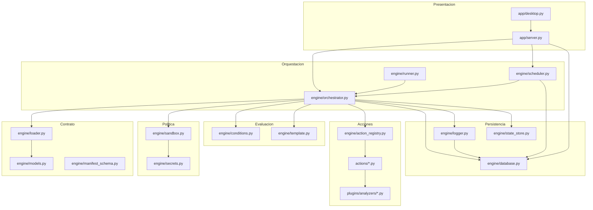
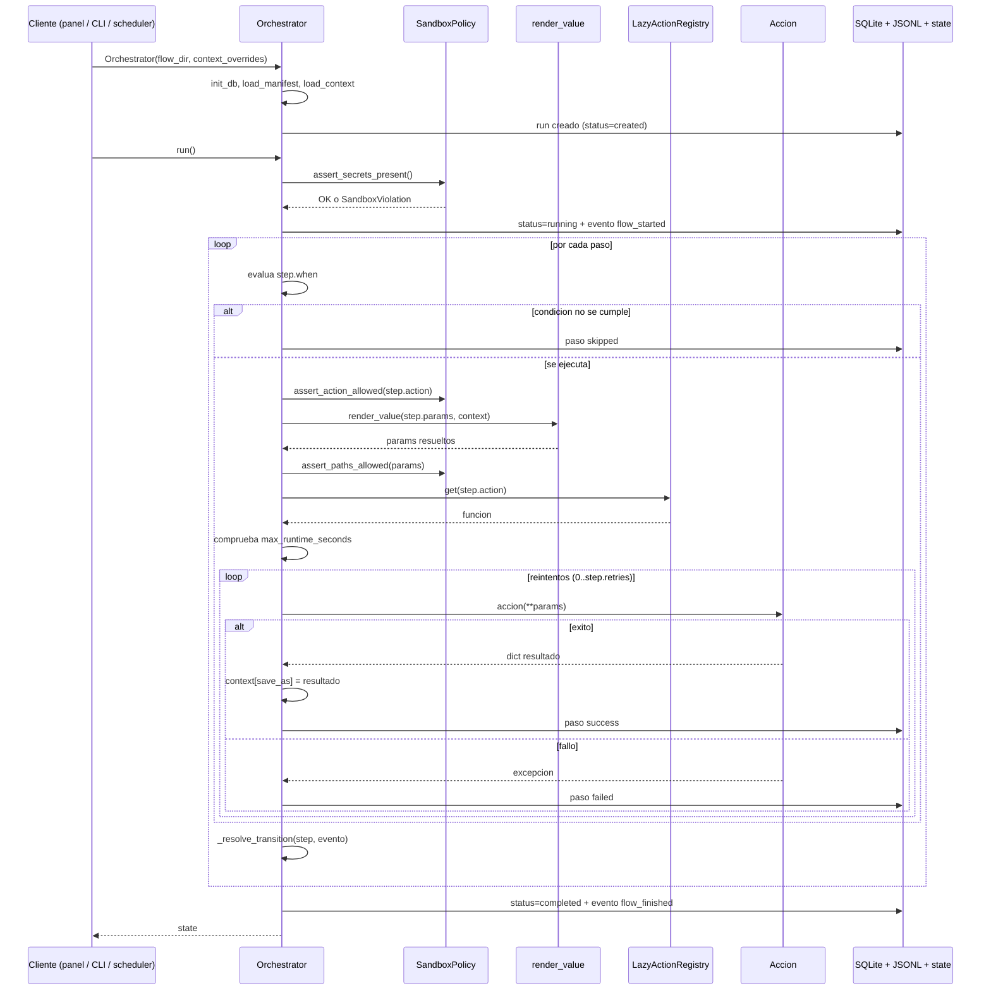
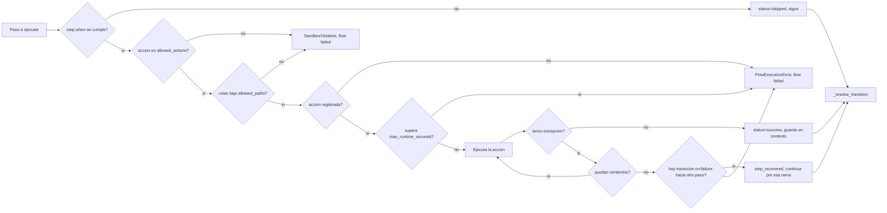
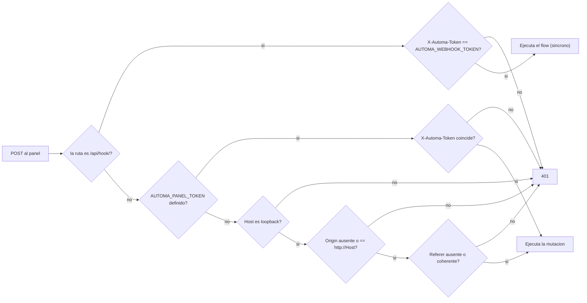
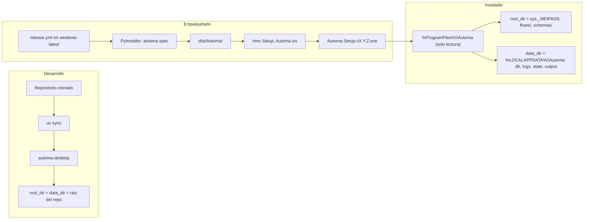

# 03 · Arquitectura

> Estilo arquitectónico, capas, patrones, manejo de estado y errores, concurrencia y
> persistencia. Cada diagrama va acompañado del párrafo que explica **lo que muestra y lo
> que no**; ningún diagrama es imprescindible para entender el texto.

---

## 1. Estilo arquitectónico

Automa es una **arquitectura en capas con motor de flujo declarativo dirigido por datos**
(*data-driven workflow engine*). Tres afirmaciones la caracterizan:

1. **El comportamiento vive en datos, no en código.** El manifest describe qué pasa; el
   motor solo sabe ejecutar pasos, evaluar condiciones y seguir transiciones. Añadir un
   caso de uso es añadir un JSON.
2. **La ejecución es una máquina de estados explícita.** Cada paso decide el siguiente
   mediante `transitions`, con `success`, `failure` o `any` como disparador y una
   condición opcional. Sin transiciones, el orden es el del array.
3. **La política de seguridad es parte del contrato, no del entorno.** Cada manifest puede
   declarar `allowed_actions`, `allowed_paths`, `required_secrets` y
   `max_runtime_seconds`, y el motor los aplica.

Es deliberadamente **monolítico y de un solo proceso**. No hay colas, ni brokers, ni
servicios. La justificación está en el propio producto: es una herramienta local para un
operador. `docs/ARQUITECTURA.md` del repositorio lo describe en la misma línea.

## 2. Capas y responsabilidades

| Capa | Directorio | Responsabilidad | Depende de |
|---|---|---|---|
| **Presentación** | `app/` | Panel HTML+CSS+JS, API JSON, ventana nativa | `engine/` |
| **Orquestación** | `engine/orchestrator.py`, `scheduler.py`, `runner.py` | Bucle de ejecución, disparo por horario, CLI | Contrato, política, acciones, persistencia |
| **Contrato** | `engine/loader.py`, `models.py`, `manifest_schema.py`, `schemas/` | Leer y validar el manifest, convertirlo en dataclasses | — |
| **Política** | `engine/sandbox.py`, `secrets.py` | Restricciones por flow, resolución de secretos | `engine/paths.py` |
| **Evaluación** | `engine/conditions.py`, `template.py` | 13 operadores, sustitución de placeholders | — |
| **Acciones** | `actions/` | Todo el trabajo efectivo sobre el sistema | Bibliotecas externas |
| **Extensión** | `plugins/analyzers/` | Analizadores de imagen intercambiables | Pillow, pytesseract, requests |
| **Persistencia** | `engine/database.py`, `logger.py`, `state_store.py` | SQLite, JSONL, snapshots JSON | `engine/paths.py` |
| **Observabilidad** | `engine/metrics.py`, `introspection.py` | Agregados SQL, detección de outputs | `engine/database.py` |
| **Catálogo** | `flows/`, `engine/catalog.py` | Los 27 casos y su lectura | `engine/database.py` |

**Regla de dependencia respetada:** `actions/` no importa `engine/orchestrator`, y el
orquestador no conoce ninguna acción concreta. La única excepción deliberada es
`actions/notify.py`, que importa `engine.secrets.get_secret` para resolver la sintaxis
`@secret:NOMBRE`.



**Lo que el diagrama muestra:** el orquestador es el único punto que toca todas las
capas; las acciones no vuelven hacia arriba. `JsonlLogger` escribe a la vez en el archivo
y en la tabla `events`, por eso apunta a `engine/database.py`.

**Lo que no muestra:** que `engine/manifest_schema.py` **no se invoca durante la
ejecución**. Solo lo usa `scripts/validate_project.py`. En tiempo de ejecución,
`FlowLoader.load_manifest` lee el JSON directamente sin validarlo contra el schema: un
manifest inválido llega hasta el motor y falla ahí, no antes. Es una decisión implícita
con consecuencias reales, registrada en [15](15-risks-and-technical-debt.md).

## 3. El bucle de ejecución paso a paso



**Lo que la secuencia muestra:** el orden exacto de los cuatro controles antes de cada
acción —secretos (una vez, al inicio), acción permitida, rutas permitidas, tiempo
máximo— y que el resultado de cada paso entra en el contexto antes de resolver la
transición, de modo que la condición del siguiente paso puede leerlo.

**Lo que no muestra, y es importante:**

- `assert_paths_allowed` se aplica **sobre los parámetros ya renderizados**, no sobre el
  manifest crudo. Es lo correcto: un placeholder sin resolver no se puede validar.
- `max_runtime_seconds` se comprueba **entre pasos**. Una acción que se cuelga dentro
  (una llamada HTTP sin timeout, un `page.goto` bloqueado) no se interrumpe: el límite
  solo se nota cuando el paso termina y el motor va a por el siguiente.
- Los reintentos comparten los **mismos parámetros renderizados**. `render_value` se
  llama una vez por paso, fuera del bucle de reintentos, así que un `{now}` no cambia
  entre intentos.
- Al fallar el último intento, el motor busca una transición `on: "failure"`. Si esa
  transición apunta a un paso **distinto** del siguiente por defecto, el flow **se
  recupera** y continúa; si no, la corrida se marca `failed`. Esa comparación
  (`recovery_next != self._default_next(step.id)`) es el mecanismo de recuperación
  completo, y es fácil pasarlo por alto leyendo el manifest.

## 4. Patrones de diseño identificados

| Patrón | Dónde | Por qué está |
|---|---|---|
| **Registry con carga perezosa** | `engine/action_registry.py::LazyActionRegistry` | Una acción solo importa su módulo cuando un flow la usa. Evita cargar Playwright, psutil o Pillow en cada arranque |
| **Plugin por entry points** | `LazyActionRegistry._maybe_load_entry_points` | Terceros publican acciones con el grupo `automa.actions` en su `pyproject.toml` sin tocar este repo |
| **Strategy** | `actions/vision.py::ANALYZERS` | `mock`, `metadata` y `ocr` implementan el mismo `AnalyzerProtocol`; el manifest elige cuál |
| **Máquina de estados** | `Orchestrator._resolve_transition` | Grafo de pasos con eventos y guardas |
| **Template method con datos** | `engine/template.py::render_value` | `{clave}` y `{objeto.campo}` se resuelven contra el contexto aplanado |
| **Repository** | `engine/database.py` | Todo el SQL vive en un módulo; nadie más abre una conexión |
| **Context manager** | `engine/database.py::connect` | `commit` automático al salir sin excepción, `close` siempre |
| **Guard clauses / fail fast** | `engine/sandbox.py` | Cada `assert_*` lanza `SandboxViolation` y aborta la corrida |
| **Degradación explícita** | `OCRImageAnalyzer`, `system.read_clipboard`, `check_urls` | Devuelven `status`/`available`/`truncated` en vez de fallar o truncar en silencio |
| **Separación puro / impuro** | `actions/browser_extract.py` | La lógica (hash, links, BFS, CSV) es pura y testeable; solo `scrape_page` toca Playwright |

El último es el patrón más valioso del repositorio y conviene protegerlo: los 31 tests
que la v0.3.0 añadió para la familia web **corren sin navegador**, porque toda la lógica
está en funciones puras y la interacción con Playwright se reduce a una capa de pegamento.
Ver [12 · Pruebas y calidad](12-testing-and-quality.md).

## 5. Manejo del estado

Hay tres estados distintos y conviene no confundirlos:

| Estado | Vive en | Alcance | Quién lo escribe |
|---|---|---|---|
| **Contexto del flow** | Memoria, `Orchestrator.context` | Una corrida | `save_as` de cada paso, más `_last_result` y `_last_error` |
| **Estado de la corrida** | `Orchestrator.state`, volcado a `state/*.json` y a la tabla `runs` | Una corrida, persistido | `Orchestrator._persist`, tras **cada** paso |
| **Estado del sistema** | `db/runs.db` | Todo el histórico | `engine/database.py` |

### El contexto es mutable y compartido

```python
# engine/orchestrator.py, dentro del bucle de reintentos
result = action(**rendered_params)
self.context['_last_result'] = result
if step.save_as:
    self.context[step.save_as] = result
self.state['context'] = self.context
```

`self.state['context']` es **la misma referencia**, no una copia. Es intencional y hace
que el snapshot persistido refleje siempre el contexto vivo, pero implica que el contexto
crece con cada paso que declara `save_as`, y que **todo él acaba serializado en la columna
`context_json` de la tabla `runs`**. Un flow que guarde el texto completo de una página
web grande (`browser.extract_content` admite hasta 200 000 caracteres por defecto) deja
ese texto dentro de la fila de la corrida. Consecuencia de tamaño registrada en
[15](15-risks-and-technical-debt.md).

### Persistencia tras cada paso

`_persist()` se llama después de cada paso, con éxito o sin él. Escribe simultáneamente
el JSON de `state/` y hace `upsert` de la fila de `runs`. El costo es una escritura de
disco y una transacción SQLite por paso; el beneficio es que una corrida interrumpida por
un corte deja rastro de hasta dónde llegó. Para un sistema de escritorio con flows de
pocos pasos, la decisión está bien calibrada.

## 6. Manejo de errores



**Lo que el diagrama muestra:** los siete puntos donde una corrida puede detenerse, y que
la recuperación por transición es el **último** recurso, después de agotar los reintentos.

**Lo que no muestra:** que el manejo de excepciones dentro de la acción es
deliberadamente amplio (`except Exception` con `# noqa: BLE001`). Cualquier fallo —de red,
de disco, de sintaxis en los parámetros— se convierte en el mismo `step_failed` con el
texto de la excepción. Es una decisión que favorece la robustez del bucle frente a la
precisión del diagnóstico. Tampoco muestra que **el scheduler se traga las excepciones
por completo**:

```python
# engine/scheduler.py::_run_job
try:
    Orchestrator(Path(flow['flow_path'])).run()
except Exception:
    # No interrumpe el loop. El error queda en la corrida.
    pass
```

El comentario es honesto: el error queda persistido en la corrida. Pero para el operador
significa que **una tarea programada que falla siempre no genera ninguna alerta**; hay que
mirar el histórico. Registrado en [15](15-risks-and-technical-debt.md).

## 7. Concurrencia: qué es paralelo y qué no

| Elemento | Modelo | Detalle |
|---|---|---|
| Pasos dentro de una corrida | **Secuencial, un hilo** | El bucle `while current_step_id` no tiene paralelismo |
| Corridas lanzadas desde el panel | Hilo por corrida | `threading.Thread(target=_runner, daemon=True)` en `do_POST` |
| Servidor HTTP | `ThreadingHTTPServer` | Un hilo por petición |
| Scheduler | Hilo de fondo + hilo por tarea | `start_in_background`, y `_run_job` en su propio hilo |
| Webhook `POST /api/hook` | **Síncrono** | A diferencia de `/api/run`, ejecuta el flow y espera. Una petición de webhook a un flow largo mantiene la conexión abierta |
| Protección contra ejecución doble | Tabla `run_locks` | Solo la aplica el **scheduler**. Ver aviso abajo |

> **El lock protege menos de lo que parece.** `acquire_run_lock` / `release_run_lock` se
> invocan **únicamente** desde `SchedulerService._run_job`. Ni `POST /api/run/<folder>`,
> ni `POST /run`, ni `POST /api/hook/<folder>`, ni el CLI lo usan. Verificado buscando las
> llamadas en todo el repositorio. Consecuencia: **el panel sí permite lanzar el mismo
> flow dos veces en paralelo**, aunque el scheduler no. Para flows con tracking persistente
> (07, 23, 26) eso significa dos procesos escribiendo el mismo archivo de estado.
> Registrado en [15](15-risks-and-technical-debt.md).

### SQLite y concurrencia

`engine/database.py::connect` abre una conexión nueva por operación y la cierra al salir.
No hay pool ni conexión compartida entre hilos, lo que evita el clásico
`ProgrammingError: SQLite objects created in a thread can only be used in that same
thread`. El costo es abrir y cerrar el archivo en cada consulta. `NO IDENTIFICADO`: el
repositorio no configura `PRAGMA journal_mode=WAL` ni `busy_timeout`, de modo que dos
escrituras simultáneas pueden producir `database is locked`.

## 8. Autenticación y autorización

No hay usuarios. Lo que sí hay es un modelo de protección de las mutaciones,
documentado en el propio `app/server.py` con un comentario de bloque de 20 líneas:



**Lo que el diagrama muestra:** dos modos excluyentes. Con `AUTOMA_PANEL_TOKEN`
definido, todo se decide por token comparado en tiempo constante
(`hmac.compare_digest`, que cierra CWE-208). Sin token, la defensa es anti-CSRF y
anti-DNS-rebinding: `Host` debe ser loopback y, **si vienen**, `Origin` y `Referer` deben
ser coherentes.

**Lo que no muestra:** que un cliente que **no envía** `Origin` ni `Referer` —cualquier
`curl`, cualquier script— pasa el control sin más, siempre que el `Host` sea loopback. La
defensa está calibrada contra el ataque real (una web maliciosa que hace `fetch` a
`127.0.0.1`, donde el navegador siempre añade `Origin`), no contra un proceso local
hostil. Es una decisión razonable y está documentada, pero conviene tenerla explícita.
Análisis completo en [11 · Seguridad](11-security.md).

**Los GET no se protegen.** `do_GET` no llama a `_authorize_mutation`. `/api/flows`,
`/api/runs`, `/metrics`, `/file?path=…` y el HTML del panel son accesibles sin token,
incluso con `AUTOMA_PANEL_TOKEN` definido. Es coherente con «lecturas inofensivas», pero
`/api/runs` devuelve el `context_json` completo de cada corrida, que puede contener datos
sensibles capturados por los flows.

## 9. Persistencia y caché

### Persistencia

Tres almacenes simultáneos, sin caché intermedia:

| Almacén | Formato | Contenido | Rotación |
|---|---|---|---|
| `db/runs.db` | SQLite, 7 tablas | Catálogo, corridas, pasos, eventos, config, locks, horarios | **Ninguna** |
| `logs/<flow_id>_<run_id>.jsonl` | JSON Lines | Un evento por línea, con marca de tiempo | **Ninguna** |
| `state/<flow_id>_<run_id>.json` | JSON | Snapshot completo del estado de la corrida | **Ninguna** |

Los eventos se escriben **dos veces**: `JsonlLogger.write` añade la línea al archivo
`.jsonl` y llama a `insert_event` para la tabla `events`. Es redundancia deliberada —el
archivo sobrevive a un borrado de la base, la tabla permite consultas— pero duplica el
tamaño de la traza.

### Caché

Hay tres cachés, todas en memoria y de vida corta:

- `LazyActionRegistry._cache` — función ya importada por nombre de acción.
- `RobotsCache._parsers` — un `robots.txt` por host durante un crawl.
- `data/seeds/.used_indices.json` y `data/web_watch/*.json` — no son caché sino
  **tracking persistente entre corridas**, y son el mecanismo que permite que el flow 07
  no repita registros y que el 23 detecte cambios.

`NO IDENTIFICADO`: no hay caché de resultados de acciones ni de consultas SQL.

## 10. Procesos en segundo plano

| Proceso | Arranca cuando | Frecuencia | Se detiene con |
|---|---|---|---|
| `SchedulerService.serve_forever` | Se **importa** `app.server`, o `automa scheduler` | Cada `loop_sleep_seconds` (2 s por defecto) | `stop()`, o al morir el proceso (hilo daemon) |
| Hilo por corrida del panel | `POST /api/run/<folder>` | Una vez por corrida | Al terminar la corrida (hilo daemon) |
| Hilo por tarea programada | El scheduler la ve vencida | Una vez por disparo | Al terminar (hilo daemon) |
| Servidor HTTP del panel | `app.desktop.launch` | Permanente | Al cerrar la ventana |

Todos son hilos **daemon**: al cerrar la ventana o matar el proceso, mueren sin esperar.
`INFERENCIA`: una corrida en curso al cerrar la ventana se interrumpe a mitad, dejando la
fila de `runs` en `status='running'` para siempre. No hay ningún mecanismo de detección
de corridas huérfanas ni de liberación automática de `run_locks` al arrancar. El
`RUNBOOK.md` del repositorio contempla la liberación manual de locks, lo que confirma que
el escenario es conocido.

## 11. Modelo de despliegue



**Lo que el diagrama muestra:** la separación entre raíz de solo lectura y raíz
escribible, que es la decisión arquitectónica más importante del empaquetado. En
desarrollo ambas coinciden con el repositorio; en el binario instalado se separan.

**Lo que no muestra:** el motivo. El `CHANGELOG.md` de la v0.2.1 lo documenta: instalado
bajo `Program Files`, `init_db()` levantaba `PermissionError [WinError 5]` al intentar
crear `_internal/db/`. La solución fue `engine/paths.py::data_dir`, que en modo *frozen*
apunta a `%LOCALAPPDATA%\Automa`. `installer/automa_entry.py` además hace
`os.chdir(data_dir())` para que las rutas relativas de los flows (`output/screenshots/…`)
caigan en disco escribible. Es un ejemplo de bug de despliegue resuelto en la
arquitectura, no con un parche.

## 12. Principios de ingeniería observados

**Lo que está bien y conviene proteger:**

- **Determinismo declarado y sostenido.** `crawl_pages` documenta en su docstring que el
  BFS toma los links en orden de aparición y sin aleatoriedad. `check_urls` verifica en
  orden de entrada. No hay `set()` iterado donde importe el orden.
- **Cotas explícitas por todas partes.** `max_links`, `max_text_chars`, `max_urls`,
  `max_pages`, `max_depth`, `max_steps_per_run`, `max_runtime_seconds`. Y cuando una cota
  se aplica, el resultado lo dice: `truncated: True`, nunca en silencio.
- **Degradación con motivo legible.** Falta `tesseract` → `status: "unavailable"` con
  instrucciones por sistema operativo. Falta backend de portapapeles → `available: False`
  con la razón. Falta Playwright → `RuntimeError` con el comando de instalación.
- **Comentarios que explican el porqué.** `engine/introspection.py` explica por qué limita
  los outputs a `output/`; `engine/template.py` explica por qué no usa `str.format_map`;
  `actions/ui.py` explica por qué `shell=True` está prohibido.
- **La seguridad del CI como parte de la arquitectura.** El repositorio trata el pipeline
  como frontera de confianza, con un razonamiento explícito en `security.yml`: «un commit
  malicioso fusionado a main se traduce directamente en RCE local cuando el operador hace
  pull».

**Dónde la arquitectura tiene tensión:**

- `app/server.py` con 1 753 líneas mezcla enrutado, HTML, CSS, JavaScript y lógica de
  presentación en un solo archivo.
- El sandbox es opcional y la mayoría de los flows no lo usan.
- El lock de ejecución solo cubre una de las cuatro vías de disparo.
- El JSON Schema existe pero el motor no lo aplica en runtime.

Cada uno de estos puntos está desarrollado, clasificado y priorizado en
[15 · Riesgos y deuda técnica](15-risks-and-technical-debt.md).

---

**Documentos relacionados:**
[04 · Mapa del código](04-code-map.md) ·
[06 · Explicación profunda](06-deep-code-explanation.md) ·
[07 · Base de datos](07-database.md) ·
[08 · Flujo de datos](08-data-flow.md) ·
[11 · Seguridad](11-security.md)
