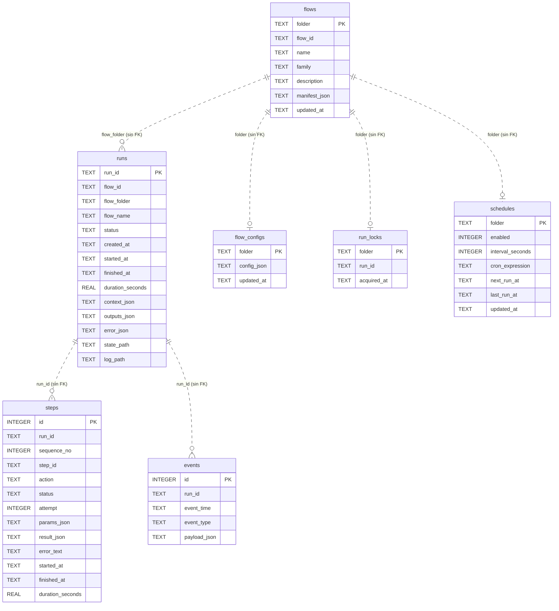

# 07 · Base de datos y persistencia

> Motor, conexión, esquema completo, diccionario de datos, ERD, consultas reales y
> relación tabla ↔ módulo. Además, los **otros tres mecanismos de persistencia** que
> conviven con SQLite y que no son base de datos.

---

## 1. Motor y ubicación

| Aspecto | Valor |
|---|---|
| Motor | **SQLite 3**, módulo `sqlite3` de la biblioteca estándar |
| ORM | **Ninguno**. SQL escrito a mano en `engine/database.py` |
| Archivo | `db/runs.db` |
| Ruta resuelta | `engine/database.py`: `DB_PATH = data_dir() / 'db' / 'runs.db'` |
| En desarrollo | `<raíz del repo>/db/runs.db` |
| En el binario instalado | `%LOCALAPPDATA%\Automa\db\runs.db` |
| Override | `AUTOMA_DATA_ROOT` |
| Creación | Automática: `init_db()` en el constructor del orquestador, del scheduler, del CLI y al importar `app.server` |
| Versionado en git | **No**: `.gitignore` excluye `db/*.db` y `db/*.db-*`. Solo se versiona `db/.gitkeep` |

**Por qué SQLite y no otro motor:** el producto es una herramienta local para un
operador. SQLite viene con Python, no necesita servicio, no necesita configuración y el
archivo se puede copiar como respaldo. `NO DOCUMENTADO EN EL REPOSITORIO`: la decisión no
está escrita en ningún ADR, pero es coherente con el resto del diseño local-first.

### Patrón de conexión

```python
@contextmanager
def connect() -> Iterable[sqlite3.Connection]:
    DB_PATH.parent.mkdir(parents=True, exist_ok=True)
    conn = sqlite3.connect(DB_PATH)
    conn.row_factory = sqlite3.Row
    try:
        yield conn
        conn.commit()
    finally:
        conn.close()
```

Conexión nueva por operación, `commit` implícito al salir sin excepción, `close`
garantizado. `row_factory = sqlite3.Row` permite acceder a las columnas por nombre y
convertirlas a `dict`.

**Configuración ausente:** `NO IDENTIFICADO` — el repositorio no establece
`PRAGMA journal_mode=WAL`, `PRAGMA busy_timeout` ni `PRAGMA foreign_keys=ON`. La última
es relevante: **no hay ninguna clave foránea declarada** en el esquema (ver §4).

## 2. Esquema completo

Siete tablas, todas creadas por `init_db()` con `CREATE TABLE IF NOT EXISTS`.



**Lo que el ERD muestra:** el modelo real es una estrella alrededor de `flows` y `runs`.
Un flow tiene muchas corridas; una corrida tiene muchos pasos y muchos eventos; un flow
tiene como mucho una configuración, un horario y un lock.

**Lo que el ERD NO muestra, y es la característica más importante del esquema:**
**ninguna de esas relaciones existe como clave foránea en el DDL**. Están dibujadas con
línea discontinua a propósito. Son relaciones lógicas que el código mantiene, no
restricciones que la base haga cumplir. Consecuencias reales en §4.

## 3. Diccionario de datos

### 3.1 `flows` — catálogo sincronizado

Espejo en base de datos de las carpetas de `flows/`. Se reescribe con `sync_flows()` al
arrancar el panel o el CLI.

| Columna | Tipo | Nulo | Descripción |
|---|---|:--:|---|
| `folder` | TEXT | PK | Nombre de la carpeta: `05_system_healthcheck` |
| `flow_id` | TEXT | No | `id` del manifest: `system_healthcheck` |
| `name` | TEXT | No | Nombre legible |
| `family` | TEXT | Sí | `sistema`, `navegador`, `pantalla`, `filesystem`, `documentos` |
| `description` | TEXT | Sí | Descripción del manifest |
| `manifest_json` | TEXT | No | **El manifest completo serializado**, incluidos los pasos |
| `updated_at` | TEXT | No | ISO-8601 UTC de la última sincronización |

> `sync_flows` hace `INSERT … ON CONFLICT(folder) DO UPDATE`. **No borra filas**: un flow
> eliminado del disco deja su fila huérfana en `flows` para siempre. El panel no lo
> mostrará (lee de `list_flows()`, que recorre el disco), pero la fila persiste.

### 3.2 `runs` — la tabla central

Una fila por corrida, sea del panel, del CLI, del scheduler o del webhook.

| Columna | Tipo | Nulo | Descripción |
|---|---|:--:|---|
| `run_id` | TEXT | PK | `20260827T143052123456Z`, o `sched_…` si lo genera el scheduler |
| `flow_id` | TEXT | No | `id` del manifest |
| `flow_folder` | TEXT | No | Carpeta del flow |
| `flow_name` | TEXT | No | Nombre legible, copiado en el momento de la corrida |
| `status` | TEXT | No | `created` → `running` → `completed` \| `failed` |
| `created_at` | TEXT | No | ISO-8601 UTC, momento de la instanciación |
| `started_at` | TEXT | Sí | Momento de entrar en `run()` |
| `finished_at` | TEXT | Sí | Momento de terminar, con éxito o con error |
| `duration_seconds` | REAL | Sí | Redondeado a 4 decimales |
| `context_json` | TEXT | Sí | **Contexto completo al final**, con todos los `save_as` |
| `outputs_json` | TEXT | Sí | Lista de archivos detectados bajo `output/` |
| `error_json` | TEXT | Sí | `null`, o `{step_id?, message, kind?}` |
| `state_path` | TEXT | Sí | Ruta del snapshot JSON |
| `log_path` | TEXT | Sí | Ruta del JSONL |

> **`context_json` es la columna de mayor riesgo de tamaño y de privacidad.** Contiene el
> contexto entero al terminar, incluidos los resultados de cada paso con `save_as`. Un
> flow que use `browser.extract_content` guarda ahí el texto completo de la página (hasta
> 200 000 caracteres por defecto). Un flow con `system.read_clipboard` guarda el contenido
> del portapapeles. Y `GET /api/runs` la devuelve **sin autenticación**. Ver
> [11 · Seguridad](11-security.md).

**Valores de `status` observados:**

| Estado | Significado |
|---|---|
| `created` | Instanciado, aún no arrancado. Rara vez persiste |
| `running` | En ejecución. **Puede quedarse aquí para siempre** si el proceso muere |
| `completed` | Todos los pasos ejecutados sin fallo irrecuperable |
| `failed` | Violación de sandbox, o fallo sin rama de recuperación |

`NO IDENTIFICADO`: no hay ningún mecanismo que detecte y corrija corridas huérfanas en
`running`.

### 3.3 `steps` — un registro por intento

| Columna | Tipo | Nulo | Descripción |
|---|---|:--:|---|
| `id` | INTEGER | PK AUTOINCREMENT | Clave técnica |
| `run_id` | TEXT | No | Corrida a la que pertenece |
| `sequence_no` | INTEGER | No | Posición: `len(state['steps'])` tras añadir |
| `step_id` | TEXT | No | `id` del paso en el manifest |
| `action` | TEXT | No | Nombre de la acción |
| `status` | TEXT | No | `success`, `failed`, `skipped` |
| `attempt` | INTEGER | No | Número de intento. **`0` si el paso se saltó** |
| `params_json` | TEXT | Sí | Parámetros **ya renderizados** |
| `result_json` | TEXT | Sí | Resultado completo de la acción |
| `error_text` | TEXT | Sí | `str(excepción)` |
| `started_at` / `finished_at` | TEXT | Sí | ISO-8601 UTC |
| `duration_seconds` | REAL | Sí | 4 decimales; `0.0` en pasos saltados |

> **`params_json` guarda los parámetros resueltos.** Si un flow recibiera un secreto por
> `context_overrides` y lo pasara como parámetro, ese secreto quedaría en claro en esta
> columna. En el catálogo actual no ocurre —ningún flow declara `required_secrets`— pero
> es una propiedad del diseño que un autor de flows debe conocer.

**Detalle no obvio:** solo se inserta **un** registro por paso, incluso con reintentos. El
`INSERT` ocurre al final: en éxito con el número del intento que funcionó, en fallo con el
último. Los intentos intermedios fallidos **solo aparecen en `events`** como `step_failed`.

### 3.4 `events` — la traza fina

| Columna | Tipo | Nulo | Descripción |
|---|---|:--:|---|
| `id` | INTEGER | PK AUTOINCREMENT | Clave técnica |
| `run_id` | TEXT | No | Corrida |
| `event_time` | TEXT | No | ISO-8601 UTC, generado por `JsonlLogger` |
| `event_type` | TEXT | No | Ver tabla siguiente |
| `payload_json` | TEXT | Sí | Carga del evento |

| `event_type` | Cuándo | Carga |
|---|---|---|
| `flow_started` | Al arrancar | `flow_id`, `run_id`, `policy` |
| `flow_finished` | Al terminar | `flow_id`, `run_id`, `status`, `error` si lo hubo |
| `flow_blocked` | Secretos ausentes | `reason` |
| `step_started` | Cada intento | `step_id`, `action`, `attempt`, `params` |
| `step_finished` | Intento con éxito | `step_id`, `status`, `result` |
| `step_failed` | Cada intento fallido | `step_id`, `attempt`, `error` |
| `step_skipped` | Condición no cumplida | `step_id`, `reason` |
| `step_blocked` | Acción o ruta prohibida | `step_id`, `reason` |
| `step_recovered` | Rama de recuperación tomada | `step_id`, `next`, `error` |

**Redundancia deliberada:** cada evento se escribe **dos veces** —línea en
`logs/*.jsonl` y fila en `events`— porque `JsonlLogger.write` hace ambas cosas. El
archivo sobrevive a un borrado de la base; la tabla permite consultar.

### 3.5 `flow_configs`, `run_locks`, `schedules`

| Tabla | Columna | Tipo | Descripción |
|---|---|---|---|
| `flow_configs` | `folder` | TEXT PK | Carpeta del flow |
| | `config_json` | TEXT | Contexto guardado desde el panel |
| | `updated_at` | TEXT | ISO-8601 UTC |
| `run_locks` | `folder` | TEXT PK | **La PK es el mecanismo de exclusión mutua** |
| | `run_id` | TEXT | Corrida que lo tomó |
| | `acquired_at` | TEXT | ISO-8601 UTC |
| `schedules` | `folder` | TEXT PK | Carpeta del flow |
| | `enabled` | INTEGER | `0` o `1`. Por defecto `0` |
| | `interval_seconds` | INTEGER | Modo intervalo |
| | `cron_expression` | TEXT | Modo cron, 5 campos. **Añadida por migración** |
| | `next_run_at` | TEXT | Próxima ejecución en UTC |
| | `last_run_at` | TEXT | Última ejecución |
| | `updated_at` | TEXT | ISO-8601 UTC |

`interval_seconds` y `cron_expression` son **excluyentes en la práctica**: `set_schedule`
prioriza `cron_expression` si viene, y el panel envía `interval_seconds` solo si no hay
cron. Pero el esquema permite ambas a la vez, y `mark_schedule_run` también prioriza el
cron. `INFERENCIA`: escribir ambas por API dejaría el intervalo inerte.

## 4. Integridad referencial: la ausencia declarada

**No hay ninguna `FOREIGN KEY` en el esquema.** Verificado leyendo el DDL completo de
`init_db()`.

| Consecuencia | Detalle |
|---|---|
| Se puede insertar un `step` con `run_id` inexistente | Nada lo impide |
| Borrar una corrida **no borra** sus pasos ni sus eventos | No hay `ON DELETE CASCADE` |
| Un flow borrado del disco deja fila en `flows`, `schedules`, `flow_configs` y `run_locks` | Ninguna limpieza automática |
| Un lock huérfano bloquea el scheduler para siempre | Se libera a mano con `force_release_lock` |

Para un sistema de un solo escritor coordinado por código, la decisión es defendible: la
integridad la mantiene `engine/database.py`, que es el único módulo que escribe. Pero
significa que **cualquier limpieza manual de la base debe hacerse tabla por tabla**.

### Índices

**Los únicos índices son los implícitos de las claves primarias** (`flows.folder`,
`runs.run_id`, `steps.id`, `events.id`, `flow_configs.folder`, `run_locks.folder`,
`schedules.folder`). No hay ningún `CREATE INDEX` explícito.

Consultas que hacen escaneo completo:

| Consulta | Filtra por | Índice |
|---|---|---|
| `list_runs(flow_id=…)` | `runs.flow_id` | ❌ |
| `list_runs()` sin filtro | `ORDER BY created_at DESC` | ❌ |
| `get_steps(run_id)` | `steps.run_id` | ❌ |
| `get_events(run_id)` | `events.run_id` | ❌ |
| `metrics.overview()` | `GROUP BY status`, `GROUP BY action` | ❌ |

`INFERENCIA`: con unos cientos de corridas es irrelevante. Con decenas de miles —y sin
retención, es cuestión de tiempo— el panel y el dashboard de métricas se degradarán.
Registrado en [15](15-risks-and-technical-debt.md).

## 5. Consultas reales del sistema

Todas viven en `engine/database.py` y `engine/metrics.py`.

### Escritura del histórico

```sql
-- upsert_run: se ejecuta tras CADA paso de CADA corrida
INSERT INTO runs(run_id, flow_id, flow_folder, flow_name, status, created_at, started_at,
                 finished_at, duration_seconds, context_json, outputs_json, error_json,
                 state_path, log_path)
VALUES(?,?,?,?,?,?,?,?,?,?,?,?,?,?)
ON CONFLICT(run_id) DO UPDATE SET
    status=excluded.status, started_at=excluded.started_at, finished_at=excluded.finished_at,
    duration_seconds=excluded.duration_seconds, context_json=excluded.context_json,
    outputs_json=excluded.outputs_json, error_json=excluded.error_json,
    state_path=excluded.state_path, log_path=excluded.log_path;
```

### Lectura del histórico

```sql
-- list_runs
SELECT * FROM runs WHERE flow_id = ? ORDER BY created_at DESC LIMIT ?;
-- get_steps
SELECT * FROM steps WHERE run_id = ? ORDER BY sequence_no ASC, id ASC;
```

El desempate por `id` en `get_steps` importa porque `sequence_no` puede repetirse si dos
inserciones ocurrieran con el mismo `len(state['steps'])`.

### El lock

```sql
INSERT INTO run_locks(folder, run_id, acquired_at) VALUES(?,?,?);   -- IntegrityError = ocupado
DELETE FROM run_locks WHERE folder = ? AND run_id = ?;              -- release
DELETE FROM run_locks WHERE folder = ?;                             -- force_release
```

### Métricas

```sql
-- Duración media por acción, top 10 más lentas
SELECT action, AVG(duration_seconds) AS avg_d, COUNT(*) AS c
FROM steps WHERE duration_seconds IS NOT NULL
GROUP BY action ORDER BY avg_d DESC LIMIT 10;

-- Reintentos acumulados por acción
SELECT action, SUM(attempt - 1) AS retry_count
FROM steps WHERE attempt > 1 GROUP BY action ORDER BY retry_count DESC LIMIT 10;

-- Resumen por flow
SELECT flow_id, COUNT(*) AS runs_total,
       SUM(CASE WHEN status='completed' THEN 1 ELSE 0 END) AS runs_completed,
       SUM(CASE WHEN status='failed'    THEN 1 ELSE 0 END) AS runs_failed,
       AVG(duration_seconds) AS avg_duration_seconds,
       MAX(created_at) AS last_run_at
FROM runs GROUP BY flow_id ORDER BY runs_total DESC LIMIT ?;
```

> **Sesgo conocido en `retry_count`:** cuenta `attempt - 1` sobre la fila **final** de
> cada paso. Como solo se guarda un registro por paso, un paso que falló dos veces y
> tuvo éxito al tercero aporta `2`; uno que falló tres veces y se rindió aporta `2`
> también (`attempt=3`). Es coherente, pero no equivale al número de fallos.

## 6. Transacciones

No hay transacciones explícitas. Cada llamada a `connect()` abre su propia transacción
implícita y hace `commit` al salir. Consecuencias:

- `insert_step` y el `upsert_run` que le sigue son **dos transacciones separadas**. Un
  corte entre ambas deja el paso guardado y la corrida con el estado anterior.
- `set_flow_config` escribe **primero el archivo y luego la fila**. No hay atomicidad
  entre ambos medios.
- `JsonlLogger.write` escribe **primero el archivo y luego la fila** de `events`. Mismo
  caso.

`INFERENCIA`: para un sistema de escritorio con corridas cortas, el riesgo es bajo y el
diseño simple lo compensa. En caso de inconsistencia, el archivo JSONL y el snapshot de
`state/` son la fuente de verdad más completa.

## 7. Relación tabla ↔ módulo

| Tabla | Escriben | Leen |
|---|---|---|
| `flows` | `sync_flows` ← `app/server.py` (al importar), `engine/runner.py` | `engine/catalog.py` (indirectamente) |
| `runs` | `upsert_run` ← `Orchestrator._persist` | `catalog.list_runs`, `find_run`, `metrics.*`, `app/server.py` |
| `steps` | `insert_step` ← `Orchestrator.run` | `catalog.load_run_steps`, `metrics.overview`, `_run_status_payload` |
| `events` | `insert_event` ← `JsonlLogger.write` | `catalog.load_run_events`, detalle de corrida |
| `flow_configs` | `set_flow_config` ← `POST /flow/<f>/config`, `smoke_test.py` | `get_flow_config` ← `catalog.get_flow_by_folder` |
| `run_locks` | `acquire_run_lock`/`release_run_lock` ← **solo** `scheduler._run_job` | `list_run_locks` ← `RUNBOOK.md` |
| `schedules` | `set_schedule` ← `POST /flow/<f>/schedule`; `mark_schedule_run` ← scheduler | `list_schedules` ← `scheduler.run_pending_once`; `get_schedule` ← panel |

## 8. Los otros tres mecanismos de persistencia

SQLite no es el único almacén. Hay tres más, y dos de ellos son funcionalmente
imprescindibles.

### 8.1 `state/<flow_id>_<run_id>.json` — snapshot completo

Escrito por `StateStore.save` tras cada paso, con `indent=2` y `ensure_ascii=False`. Es el
`state` completo: definición, contexto, todos los pasos con sus resultados, la ruta
recorrida y los outputs. **Es un superconjunto de lo que hay en `runs`**, y sirve para
reconstruir una corrida si la base se pierde.

Se reescribe entero en cada paso. Un flow de 20 pasos con contexto grande escribe el JSON
completo 20 veces.

### 8.2 `logs/<flow_id>_<run_id>.jsonl` — traza append-only

Escrito por `JsonlLogger.write` con modo `'a'`. Una línea JSON por evento, con
`timestamp`, `event` y la carga. Es el único almacén **append-only** del sistema: nada lo
reescribe.

### 8.3 Tracking persistente entre corridas — **el más importante funcionalmente**

Tres archivos JSON fuera de SQLite que dan memoria a los flows:

| Archivo | Escrito por | Para qué | Versionado |
|---|---|---|---|
| `data/seeds/.used_indices.json` | `browser_form._save_used_ids` | Que el flow 07 no repita registro | ❌ `.gitignore` |
| `data/web_watch/demo_page.json` | `browser_extract.apply_tracking` | Línea base del flow 23 | ❌ `.gitignore` |
| `data/web_watch/precio_demo.json` | `browser_extract.apply_tracking` | Línea base del flow 26 | ❌ `.gitignore` |

**Sin ellos, los flows 07, 23 y 26 pierden su función.** Un `git clean` o un borrado de
`data/web_watch/` hace que la próxima corrida del 23 reporte `first_run: true` y no
detecte el cambio que estaba vigilando. La carpeta `data/web_watch/` **no existe en un
clon limpio**; se crea sola en la primera corrida.

Formato de `.used_indices.json`:

```json
{
  "total_in_dataset": 100,
  "used_count": 7,
  "remaining": 93,
  "used_ids": [3, 12, 41, 55, 68, 77, 91]
}
```

Formato de un archivo de `data/web_watch/`:

```json
{
  "url": "file:///C:/dev/automa-pc/data/web/demo_page.html",
  "watch_value": "a3f5…(SHA-256 del texto normalizado)",
  "checked_at": "2026-08-27T14:30:52.123456+00:00"
}
```

### 8.4 `secrets/secrets.json` y `configs/<folder>.json`

- `secrets/secrets.json` — escrito por `engine.secrets.set_secret`, **texto plano sin
  cifrar**. El control de acceso son los permisos del sistema de archivos. El docstring del
  módulo lo declara: «permisos del FS son el control de acceso». Ignorado por git.
- `configs/<folder>.json` — escrito por `set_flow_config`. **Versionado** en el caso de
  `configs/03_folder_inventory.json`.

## 9. Respaldo y recuperación

`NO IDENTIFICADO`: el repositorio **no incluye ninguna rutina de respaldo, purga,
compactación ni retención**. Verificado buscando `VACUUM`, `DELETE FROM runs`, `backup` y
`retention` en todo el código.

Procedimiento manual, `INFERENCIA` a partir de la estructura:

```bash
# Respaldo en caliente (SQLite lo soporta con el proceso corriendo)
sqlite3 db/runs.db ".backup 'db/runs-backup-$(date +%Y%m%d).db'"

# Respaldo completo: incluir los almacenes que NO están en la base
tar -czf automa-backup.tar.gz db/runs.db logs/ state/ configs/ data/seeds/.used_indices.json data/web_watch/
```

**Restauración total:** parar el panel, sustituir `db/runs.db`, arrancar. `init_db()` no
destruye nada.

**Reinicio limpio:** borrar `db/runs.db`. Se recrea vacía en el siguiente arranque. El
`RUNBOOK.md` del repositorio documenta este procedimiento junto con la liberación de
locks.

**Crecimiento sin control:** las tres carpetas crecen indefinidamente. Un flow programado
cada 15 minutos genera 96 corridas al día, cada una con su fila en `runs`, sus filas en
`steps` y `events`, su `.jsonl` y su `.json` de estado. `INFERENCIA`: en un año son unas
35 000 corridas y 70 000 archivos sueltos en `logs/` y `state/`. Registrado como riesgo en
[15](15-risks-and-technical-debt.md).

## 10. Datos sensibles almacenados

| Dato | Dónde acaba | Riesgo |
|---|---|---|
| Contenido del portapapeles (flow 15) | `runs.context_json`, `steps.result_json`, `state/*.json`, `output/reports/*.json` | **Alto**: puede contener contraseñas copiadas |
| Capturas del escritorio (flows 01, 09, 12, 16, 17, 19) | `output/screenshots/*.png` | **Alto**: cualquier cosa visible en pantalla |
| Texto OCR del escritorio (flows 12, 17) | `runs.context_json`, reportes JSON | **Alto**: texto de ventanas abiertas |
| Salida de PowerShell (flow 18) | `runs.context_json`, reportes | Medio: inventario del equipo |
| Rutas y nombres de archivo (flows 03, 04) | `runs.context_json` | Bajo-medio |
| Datos del formulario (flow 07) | `output/reports/form_submission_*.json` | Bajo: son datos sintéticos del seed |
| Contenido de páginas web (flows 21–27) | `runs.context_json`, reportes | Depende de la URL configurada |
| Tokens (`AUTOMA_*`) | `secrets/secrets.json` **sin cifrar** | Medio |

**El punto crítico:** todo eso es legible desde `GET /api/runs`, que **no exige
autenticación**, y desde `GET /file?path=…`, que sirve cualquier archivo bajo la raíz del
proyecto salvo las extensiones bloqueadas —los PNG **no** están bloqueados. Análisis
completo en [11 · Seguridad](11-security.md).

## 11. Cómo inspeccionar la base a mano

```bash
sqlite3 db/runs.db ".tables"
sqlite3 db/runs.db ".schema runs"

# Últimas 10 corridas
sqlite3 db/runs.db "SELECT run_id, flow_id, status, duration_seconds FROM runs
                    ORDER BY created_at DESC LIMIT 10;"

# Corridas fallidas con su motivo
sqlite3 db/runs.db "SELECT run_id, flow_id, error_json FROM runs WHERE status='failed';"

# Corridas colgadas en running
sqlite3 db/runs.db "SELECT run_id, flow_id, started_at FROM runs WHERE status='running';"

# Locks activos
sqlite3 db/runs.db "SELECT * FROM run_locks;"

# Horarios habilitados
sqlite3 db/runs.db "SELECT folder, enabled, interval_seconds, cron_expression, next_run_at
                    FROM schedules WHERE enabled=1;"

# Tamaño de los contextos guardados (la columna que más crece)
sqlite3 db/runs.db "SELECT run_id, LENGTH(context_json) AS bytes FROM runs
                    ORDER BY bytes DESC LIMIT 10;"
```

El `RUNBOOK.md` del repositorio incluye consultas equivalentes para la operación diaria.

---

**Documentos relacionados:**
[03 · Arquitectura](03-architecture.md) ·
[06 · Explicación profunda](06-deep-code-explanation.md) ·
[08 · Flujo de datos](08-data-flow.md) ·
[11 · Seguridad](11-security.md) ·
[13 · Despliegue y operación](13-deployment-and-operations.md)
