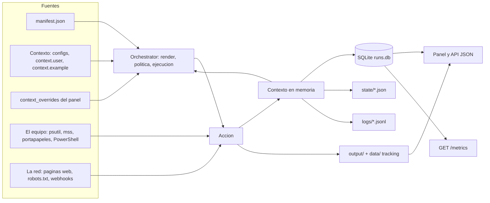
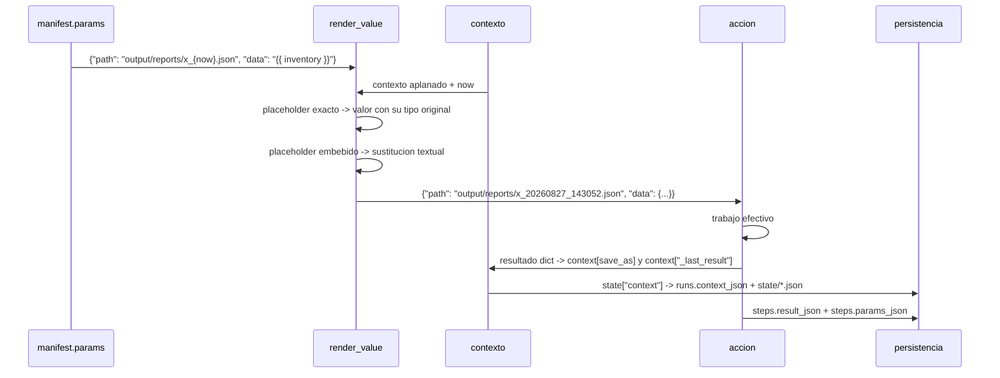
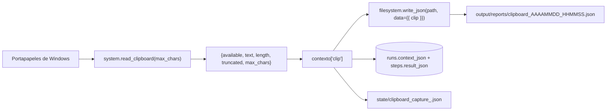
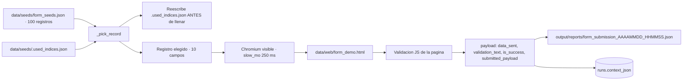

# 08 · Flujo de datos

> De dónde vienen los datos, cómo se validan, cómo se transforman, dónde se guardan,
> quién los consume, dónde se pueden perder y qué datos personales o sensibles atraviesan
> el sistema.

---

## 1. Panorama: las cinco fuentes y los cuatro destinos



**Lo que el diagrama muestra:** las tres fuentes de configuración entran por el motor y
las dos fuentes de mundo real entran por la acción. Todo converge en el contexto, y el
contexto se persiste por triplicado.

**Lo que no muestra:** que el contexto es **acumulativo y una sola referencia**. No hay
copia por paso: `self.state['context'] = self.context` apunta al mismo diccionario. Lo
que un paso guarda con `save_as` queda visible para todos los siguientes y acaba entero
en la columna `context_json` de la tabla `runs`.

## 2. Origen de los datos

### 2.1 El manifest — datos de estructura

`flows/<carpeta>/manifest.json`, leído por `FlowLoader.load_manifest`. Define pasos,
acciones, parámetros con placeholders, condiciones y transiciones. **No se valida contra
el JSON Schema en tiempo de ejecución**: el schema solo lo aplica
`scripts/validate_project.py` en la CI. Un manifest inválido llega hasta el motor y falla
con `KeyError`.

### 2.2 El contexto — datos de configuración

`FlowLoader.load_context` resuelve **la primera fuente que exista** y descarta las demás:

| Prioridad | Fuente | Quién la escribe |
|---:|---|---|
| 1 | `--context RUTA` del CLI | El operador |
| 2 | `configs/<carpeta>.json` | El panel, en `POST /flow/<f>/config` |
| 3 | `flows/<carpeta>/context.user.json` | El operador, a mano. No versionado |
| 4 | `flows/<carpeta>/context.example.json` | El autor del flow. Versionado |

**No hay mezcla de claves.** Si existe `configs/03_folder_inventory.json`, el
`context.example.json` del flow 03 se ignora por completo, aunque una versión posterior
del flow añada claves nuevas. Es la trampa de configuración más probable del sistema.

### 2.3 Los overrides — datos de invocación

```json
POST /api/run/03_folder_inventory
{"context_overrides": {"path_override": "C:/Users/ejemplo/Documentos"}}
```

Se fusionan con `{**contexto, **overrides}`: **reemplazo superficial de claves de primer
nivel**. Un override de un objeto anidado borra el resto de sus claves.

### 2.4 El equipo — datos del mundo real

| Dato | Acción | Biblioteca |
|---|---|---|
| CPU, RAM, disco | `system.snapshot_system` | `psutil` |
| Procesos | `system.top_processes` | `psutil` |
| Píxeles del escritorio | `screen.capture_*` | `mss`, respaldo `Pillow` |
| Ventana en foco | `screen.capture_active_window` | `PyGetWindow` |
| Portapapeles | `system.read_clipboard` | `pyperclip` |
| Inventario del sistema | `system.run_powershell` | `subprocess` + PowerShell |
| Texto en imágenes | `vision.ocr_image` | `pytesseract` + binario `tesseract` |
| Archivos y carpetas | `filesystem.*` | Biblioteca estándar |

### 2.5 La red — datos externos

| Dato | Acción | Salida |
|---|---|---|
| DOM renderizado | `browser.extract_content`, `crawl_site`, `capture_page` | Chromium |
| Estado de enlaces | `http.check_urls` | `requests` HEAD/GET |
| Contenido de una URL | `http.fetch_url` | `requests` GET |
| `robots.txt` | `RobotsCache._fetch` | `requests` GET |
| Notificación | `notify.send` con `backend: webhook` | `requests` POST |

**Todos los flows web apuntan por defecto a archivos locales del repositorio**
(`data/web/demo_page.html`, `data/web/site_demo/index.html`, `data/web/control_page.html`).
Verificado leyendo los ocho `context.example.json` correspondientes. Sin cambiar la
configuración, **el sistema no genera tráfico de red**.

## 3. Validación: qué se comprueba y qué no

| Punto | Qué valida | Cuándo | Módulo |
|---|---|---|---|
| JSON Schema | Estructura completa del manifest, `additionalProperties: false` | **Solo en CI** | `scripts/validate_project.py` |
| Acciones registradas | Que cada `action` exista | Solo en CI | `validate_project.py` |
| Coherencia con `allowed_actions` | Que ningún paso use una acción que su propia política prohíbe | Solo en CI | `validate_project.py` |
| Transiciones y `start_step` | Que apunten a pasos existentes | Solo en CI | `validate_project.py` |
| `_safe_folder` | Slug de la URL: `^[A-Za-z0-9_\-]{1,64}$` | En cada petición | `app/server.py` |
| Ruta de `/file` | NUL, controles, absolutas, prefijo, extensión | En cada petición | `app/server.py::do_GET` |
| `_authorize_mutation` | Token, o `Host`/`Origin`/`Referer` | En cada POST | `app/server.py` |
| `assert_secrets_present` | Variables de entorno presentes y no vacías | Una vez por corrida | `engine/sandbox.py` |
| `assert_action_allowed` | Acción en la lista blanca | Antes de cada paso | `engine/sandbox.py` |
| `assert_paths_allowed` | Rutas renderizadas bajo `allowed_paths` | Antes de cada paso | `engine/sandbox.py` |
| Tokens de PowerShell | `;`, `\|`, `&`, backtick, `>`, `<`, `$(`, `$_` | En la acción | `actions/system.py` |
| Allowlist de verbos | Primera palabra del comando | En la acción | `actions/system.py` |
| `shell=True` prohibido | Cierra CWE-78 | En la acción | `actions/ui.py` |

**Lo que NO se valida en ningún punto:**

- Que los `params` de un paso coincidan con la **firma** de la acción. Un
  `screen.capture_screenshot` sin `output_path` pasa la CI y falla en ejecución con
  `TypeError`.
- Que el **tipo** de un valor del contexto sea el esperado. Un umbral escrito como
  `"80"` en vez de `80` produce `TypeError` al comparar en `conditions.matches`.
- El **contenido** de un `context_overrides`: se acepta cualquier diccionario.
- La **URL** de `browser.*`: `_to_url` solo comprueba que, si no es URL, el archivo
  exista.

## 4. Transformación: el ciclo de un dato dentro de una corrida



**Lo que la secuencia muestra:** los dos modos de `render_value`. Un `"{{ inventory }}"`
solo (placeholder exacto) devuelve el **diccionario entero**; un `"x_{now}.json"`
(embebido) hace sustitución textual. Es lo que permite que el flow 04 pase el resultado
completo de un paso como `data` del siguiente.

**Lo que no muestra:** que `{now}` se recalcula en **cada** llamada a `render_value`, es
decir, una vez por paso. Dos pasos del mismo flow pueden obtener timestamps distintos si
cruzan el cambio de segundo. Los flows del repositorio lo evitan pasando la ruta por el
contexto con `save_as` en lugar de recomputar `{now}`.

### Ejemplo real y completo: `04_document_drop_pipeline`

Cuatro pasos, encadenados por contexto. Rastro del dato paso a paso:

| Paso | Acción | Entrada | `save_as` | Qué añade al contexto |
|---|---|---|---|---|
| `scan_dropbox` | `filesystem.list_directory` | `{{ dropbox_path }}` | `inventory` | `{path, files[], total_files}` |
| `classify_dropbox` | `filesystem.classify_file_inventory` | `{{ inventory.files }}` | `stats` | `{total_files, total_size_bytes, by_extension, largest_file}` |
| `summarize_texts` | `filesystem.summarize_text_folder` | `{{ dropbox_path }}`, `max_files: 10`, `max_chars_per_file: 500` | `summary` | `{path, processed_files, summaries[]}` |
| `write_pipeline_report` | `filesystem.write_json` | `{{ inventory }}`, `{{ stats }}`, `{{ summary }}` | `report` | `{path, written}` |

Nótese `{{ inventory.files }}` en el paso 2: usa el **contexto aplanado** para bajar un
nivel dentro del resultado del paso 1. Es el mecanismo que hace innecesario cualquier
código de pegamento.

**Pérdida de información silenciosa en este flow:** `summarize_text_folder` corta en
`max_files: 10` y solo acepta cinco extensiones. Una carpeta con 50 logs produce un
informe de 10, y el JSON **no dice cuántos quedaron fuera** — solo `processed_files: 10`.
Es la única cota del sistema que no se declara explícitamente. Registrado en
[15](15-risks-and-technical-debt.md).

## 5. Almacenamiento: qué acaba dónde

| Dato | `runs.context_json` | `steps.result_json` | `state/*.json` | `logs/*.jsonl` | `output/` |
|---|:--:|:--:|:--:|:--:|:--:|
| Parámetros renderizados | — | ✅ (`params_json`) | ✅ | ✅ (`step_started`) | — |
| Resultado de cada paso | ✅ | ✅ | ✅ | ✅ (`step_finished`) | — |
| Texto de una página web | ✅ | ✅ | ✅ | ✅ | ✅ si hay markdown |
| Portapapeles | ✅ | ✅ | ✅ | ✅ | ✅ JSON |
| Texto OCR del escritorio | ✅ | ✅ | ✅ | ✅ | ✅ JSON |
| Captura PNG | Solo la ruta | Solo la ruta | Solo la ruta | Solo la ruta | ✅ binario |
| Salida de PowerShell | ✅ | ✅ | ✅ | ✅ | ✅ JSON |
| Mensaje de error | ✅ (`error_json`) | ✅ (`error_text`) | ✅ | ✅ (`step_failed`) | — |

**Cuatro copias del mismo dato es la norma, no la excepción.** El resultado de un paso se
escribe en `steps.result_json`, en `runs.context_json`, en el snapshot de `state/` y en la
línea `step_finished` del JSONL. Es redundancia deliberada por trazabilidad, y explica por
qué el volumen crece rápido.

### Tracking persistente entre corridas

Tres archivos JSON dan **memoria** a los flows más allá de una corrida:

| Archivo | Flow | Qué recuerda | Qué pasa si se borra |
|---|---|---|---|
| `data/seeds/.used_indices.json` | 07 | IDs de registros ya usados | El ciclo empieza de cero; se repiten registros |
| `data/web_watch/demo_page.json` | 23 | SHA-256 del texto de la última corrida | Próxima corrida: `first_run: true`, no detecta el cambio |
| `data/web_watch/precio_demo.json` | 26 | Último valor leído del selector CSS | Igual |

**Ninguno está versionado.** `data/web_watch/` ni siquiera existe en un clon limpio: se
crea sola en la primera corrida. Es diseño, no defecto — la primera corrida establece la
línea base y lo declara con `first_run: true`.

## 6. Consumo: quién lee qué

| Consumidor | Fuente | Ruta |
|---|---|---|
| Pestaña **Ejecutar** | `flows` en disco + última corrida de `runs` | `render_home` |
| Pestaña **Programadas** | `schedules` | `render_home` |
| Pestaña **Histórico** | `runs` | `render_home`, `render_flow_history` |
| Detalle de corrida | `runs` + `steps` + `events` | `render_run_detail` |
| Polling durante la ejecución | `runs` + `steps` + manifest | `GET /api/runs/<run_id>/status` |
| Dashboard de métricas | Agregados de `runs` + `steps` | `render_metrics_dashboard` |
| Prometheus | Agregados | `GET /metrics` |
| Vistas previas e imágenes | `output/` vía `outputs_json` | `GET /file?path=…` |
| Integrador externo | `runs` | `GET /api/runs`, `GET /api/flows` |

### El resumen legible del panel

`app/server.py::_smart_summary` traduce el contexto crudo en texto para humanos. **Pero
solo cubre 6 de los 27 flows.** Verificado leyendo la cadena de `elif` completa: hay rama
para `screen_capture_analyze`, `screen_capture_browser`, `folder_inventory`,
`document_drop_pipeline`, `system_healthcheck` y `process_watchdog`. Para los otros 21
—incluidos `browser_form_filler` y los siete de la familia web— la función devuelve cadena
vacía y `render_run_detail` **omite el bloque entero**; el operador ve solo los pasos
colapsables con su JSON.

Es una divergencia con el `README.md` del repositorio, que en su demo de cinco minutos
afirma que el detalle del flow 07 muestra «los 10 datos enviados como lista legible».
Registrado en [15 · Riesgos y deuda técnica](15-risks-and-technical-debt.md).

Además, cada rama depende de las **claves concretas** que devuelve cada acción
(`capture.width`, `stats.by_extension`, `snapshot.cpu_percent`…): cambiar el nombre de un
campo de retorno degrada el resumen sin romper nada. Acoplamiento implícito entre
presentación y acciones.

## 7. Dónde se pierden o corrompen datos

| Punto | Qué se pierde | Se declara | Gravedad |
|---|---|:--:|---|
| `summarize_text_folder` con más de `max_files` | Los archivos sobrantes | ❌ | Media |
| `summarize_text_folder` con extensiones no soportadas | Los archivos ignorados | ❌ | Media |
| `top_processes` con `AccessDenied` | Procesos privilegiados | Parcial (`total_seen`) | Baja |
| `apply_tracking` con archivo de estado corrupto | La línea base | ❌ **Se reinicia en silencio** | Media |
| `resolve_links` con más de `max_links` | Enlaces sobrantes | ✅ `links_truncated` | Baja |
| `extract_content` con más de `max_text_chars` | Texto sobrante | ✅ `text_truncated` | Baja |
| `check_urls` con más de `max_urls` | URLs sobrantes | ✅ `truncated` | Baja |
| `run_powershell` con salida larga | Más allá de 50 000 / 5 000 chars | ✅ `*_truncated` | Baja |
| `read_clipboard` con más de `max_chars` | Texto sobrante | ✅ `truncated` + `length` real | Baja |
| `crawl_pages` con `max_pages` alcanzado | Páginas pendientes | ✅ `truncated` | Baja |
| `_pick_record` cuando el llenado falla después | Un registro del seed, marcado como usado sin llegar a enviarse | ❌ | Baja |
| Proceso muerto a mitad de corrida | Nada persistido; la fila queda en `running` para siempre | ❌ | Media |
| `set_flow_config` si falla el `INSERT` tras escribir el archivo | Desincronización archivo/tabla | ❌ | Baja |
| Dos corridas del mismo flow en paralelo desde el panel | Escritura concurrente del archivo de tracking | ❌ | Media |

**Balance honesto:** el sistema declara nueve de sus trece cotas. Las cuatro que no lo
hacen están concentradas en `summarize_text_folder` y en `apply_tracking`.

## 8. Datos personales y sensibles

| Categoría | Flows | Dónde acaba | Retención |
|---|---|---|---|
| **Contenido del portapapeles** | 15 | `context_json`, `result_json`, `state/`, `output/reports/` | Indefinida |
| **Capturas de pantalla** | 01, 09, 12, 16, 17, 19 | `output/screenshots/*.png` | Indefinida |
| **Texto OCR de ventanas abiertas** | 12, 17 | `context_json`, `output/reports/` | Indefinida |
| **Inventario del equipo** | 05, 06, 18 | `context_json`, `output/reports/` | Indefinida |
| **Rutas y nombres de archivo personales** | 03, 04, 10 | `context_json`, `output/reports/` | Indefinida |
| **Contenido de páginas web** | 21–27 | `context_json`, `output/reports/`, `output/*.md` | Indefinida |
| Datos de formulario | 07 | `output/reports/form_submission_*.json` | Indefinida. **Sintéticos**: vienen del seed |

**Los tres puntos de mayor exposición**, en orden:

1. **`system.read_clipboard`** — el portapapeles puede contener contraseñas recién
   copiadas de un gestor. El flow 15 las escribiría en claro en cuatro sitios distintos.
2. **Las capturas de escritorio** — cualquier cosa visible: correo abierto, chat, un
   documento confidencial. Y `GET /file?path=…` **sirve PNG sin autenticación**: la
   allowlist de extensiones bloquea `.html`, `.js`, `.svg` y `.css`, pero **no `.png`**.
3. **`GET /api/runs`** — devuelve `context_json` de todas las corridas, **sin exigir
   token**, incluso con `AUTOMA_PANEL_TOKEN` definido (`do_GET` no llama a
   `_authorize_mutation`).

Ningún control de privacidad está implementado: no hay anonimización, no hay redacción de
campos, no hay cifrado en reposo, no hay retención. Análisis completo en
[11 · Seguridad](11-security.md).

## 9. Qué sale del equipo

Con la configuración por defecto: **nada**. Verificado leyendo los 27 `context.example.json`
y los 27 manifests.

| Salida potencial | Se activa cuando | Por defecto |
|---|---|---|
| Petición HTTP a una página | El operador cambia `target_url` a una URL remota | Apunta a `data/web/*.html` |
| `robots.txt` | Igual, en el flow 22 | Local, sin red |
| Verificación de enlaces | Flow 24 sobre una página con enlaces externos | Página local con enlaces locales |
| Webhook de notificación | `notify_backend: "webhook"` en los flows 23 o 26 | `"file"` |
| Proveedor de IA | Un flow nuevo que llame a `vision.inspect_screen_target` con proveedor ≠ `mock` | **Ningún flow lo usa** |
| Telemetría del producto | — | **No existe** |

El único servidor que Automa levanta escucha en `127.0.0.1`. No hay cliente que se
conecte a ningún servicio del proyecto.

## 10. Tres flujos completos, de punta a punta

### 10.1 `15_clipboard_capture` — el más corto y el más sensible



Dos pasos, una lectura del sistema, **cuatro copias del texto copiado**. El flow declara
`allowed_actions` y `allowed_paths: ["output/reports"]`, así que `assert_paths_allowed`
comprueba la clave `path` del segundo paso. Pero la política **no impide** que el texto
acabe en `context_json`: el sandbox controla dónde escriben las acciones, no qué guarda el
motor.

### 10.2 `23_web_change_detector` — el que usa memoria entre corridas

| Paso | Acción | Decisión |
|---|---|---|
| `extract_and_track` | `browser.extract_content` con `track_state_path` y `retries: 1` | Compara el SHA-256 del texto normalizado con el guardado |
| `evaluate_change` | `rules.evaluate` | `content.changed == true` → `alerta`; `content.first_run == true` → `baseline`; si no, `ok` |
| `notify_change` | `notify.send` | **Solo si** `decision.status == "alerta"` |
| `write_report` | `filesystem.write_json` | Siempre |

La condición del tercer paso vive en el manifest, no en el código:

```json
"when": {"path": "decision.status", "operator": "eq", "value": "alerta"}
```

Cuando no se cumple, el paso se registra como `skipped` con `reason:
condition_not_met` — queda constancia de que se evaluó y no se disparó.

**El dato que cruza corridas** es `data/web_watch/demo_page.json`, escrito por
`apply_tracking` **antes** de devolver el resultado. Si el flow falla en un paso
posterior, la línea base ya se actualizó: la próxima corrida comparará contra el valor
nuevo y no detectará el cambio que se perdió.

### 10.3 `07_browser_form_filler` — el que más datos mueve



**Tres detalles del flujo que no se ven en el manifest:**

1. El tracking se escribe **antes** del llenado. Un fallo del navegador consume el
   registro igualmente.
2. `is_success` se decide comparando texto: `validation_text.startswith('✅') or 'válido'
   in validation_text.lower()`. Depende del copy de la página de demo.
3. Los nombres de los diez campos están **en el código Python**, no en el manifest.
   Apuntar el flow a otro formulario exige tocar `actions/browser_form.py`.

## 11. Integridad y determinismo

**Lo determinista:**

- El BFS de `crawl_pages` recorre los enlaces en orden de aparición en el DOM, sin
  aleatoriedad. El docstring lo declara.
- `check_urls` verifica en orden de entrada.
- `resolve_links` preserva el orden y deduplica por URL absoluta.
- `rules.evaluate` se detiene en la primera regla que coincide, siempre la misma.
- `normalize_text` produce el mismo texto para el mismo HTML, lo que hace estable el
  SHA-256.

**Lo no determinista, y es una sola cosa:**

- `random.choice` en `browser_form._pick_record`, **sin semilla**. Es intencional: el
  objetivo es no repetir registros entre corridas.

El docstring de `browser_extract.py` distingue con precisión las dos cosas: «El contenido
de una web puede cambiar entre corridas — lo determinista es el comportamiento y la
estructura de salida, no el contenido remoto».

---

**Documentos relacionados:**
[03 · Arquitectura](03-architecture.md) ·
[06 · Explicación profunda](06-deep-code-explanation.md) ·
[07 · Base de datos](07-database.md) ·
[10 · Configuración](10-configuration.md) ·
[11 · Seguridad](11-security.md)
