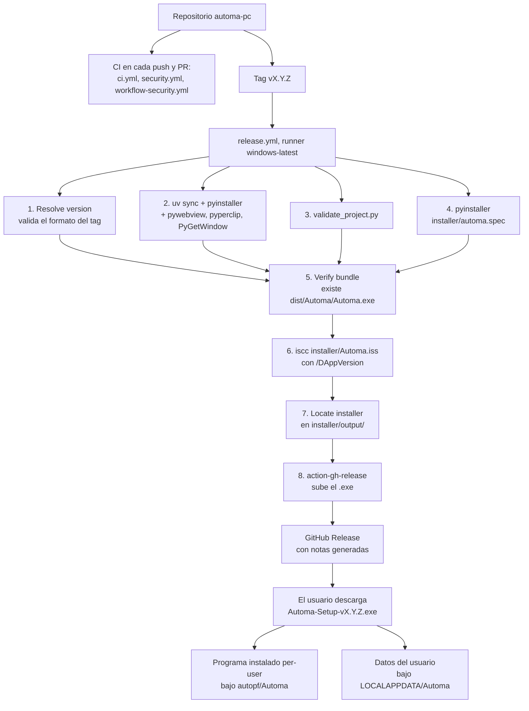

# 13 · Despliegue y operación

> Entornos, construcción, empaquetado, CI/CD, publicación, logs, métricas, respaldo,
> recuperación, rollback y mantenimiento. Incluye cómo regenerar esta documentación en PDF.

---

## 1. Entornos

Automa no tiene entornos en el sentido de un servicio. Tiene **tres modos de ejecución**:

| Modo | Cómo se lanza | Raíz de lectura | Raíz de escritura | Destinatario |
|---|---|---|---|---|
| **Desarrollo** | `uv run automa-desktop` o `automa-panel` | Repositorio | **La misma** | Desarrollador |
| **Empaquetado** | `Automa.exe` del instalador | `sys._MEIPASS` | `%LOCALAPPDATA%\Automa` | Operador final |
| **CI** | `uv run pytest` en GitHub Actions | Repositorio | La misma, efímera | Automático |

La separación entre raíz de lectura y raíz de escritura es la decisión de despliegue más
importante del proyecto, y nació de un fallo real documentado en el `CHANGELOG.md` de la
v0.2.1: instalado bajo `Program Files`, `init_db()` levantaba
`PermissionError [WinError 5]`.



**Lo que el diagrama muestra:** los ocho pasos del pipeline de release y dónde acaban el
programa y sus datos.

**Lo que no muestra:** que `release.yml` **no ejecuta la suite de pruebas**. Corre
`validate_project.py` pero no `pytest`. Un tag sobre un commit con pruebas rojas produciría
un instalador igualmente. Es defendible —el tag suele ponerse sobre un commit ya validado
por `ci.yml`— pero no hay nada que lo garantice. `INFERENCIA`.

## 2. Construcción del binario

### PyInstaller

`installer/automa.spec` produce un bundle *one-folder* en `dist/Automa/`:

| Elemento | Contenido |
|---|---|
| Entry point | `installer/automa_entry.py` |
| `datas` | `flows/` y `schemas/` del repositorio, más los datafiles de `webview` |
| `hiddenimports` | 10 módulos de `actions/`, todos los submódulos de `webview`, `mss`, `mss.tools`, `pyautogui`, `pygetwindow`, `pyperclip`, `PIL.Image`, `PIL.ImageGrab`, `pytesseract` |
| `excludes` | `tkinter`, `test`, `unittest` |
| `console` | `False` — aplicación GUI, sin consola flotante |
| `upx` | `False` |
| `icon` | `None` |
| `codesign_identity` | `None` |

> ### ⚠️ Hallazgo abierto: falta `actions.browser_extract`
>
> La lista `hiddenimports` enumera `actions.filesystem`, `screen`, `vision`, `system`,
> `rules`, `ui`, `http_actions`, `notify`, `browser_capture` y `browser_form`. **No
> incluye `actions.browser_extract`**, añadido en la v0.3.0. Verificado:
> `grep -c "browser_extract" installer/automa.spec` devuelve `0`.
>
> `LazyActionRegistry.get` importa con `import_module(module_name)`, un import **dinámico**
> que el analizador estático de PyInstaller no rastrea. `INFERENCIA`: el módulo no se
> incluiría en el bundle y los siete flows de la familia web (21–27) fallarían con
> `ModuleNotFoundError: No module named 'actions.browser_extract'` dentro del `.exe`.
>
> `REQUIERE VALIDACIÓN`: no se compiló durante este análisis. La comprobación es directa:
> compilar, instalar y ejecutar el flow 21.
>
> Registrado en [15 · Riesgos y deuda técnica](15-risks-and-technical-debt.md).

**Segundo punto de atención en el mismo archivo:** `playwright` no aparece ni en `datas`
ni en `hiddenimports`, y el navegador Chromium tampoco se empaqueta. Los nueve flows de
navegador no funcionarían en el binario aunque se arreglara lo anterior. `INFERENCIA`
coherente con el tamaño del instalador: incluir Chromium añadiría cientos de megabytes.

### Inno Setup

`installer/Automa.iss` empaqueta `dist/Automa/` en un `.exe` instalable:

| Directiva | Valor | Consecuencia |
|---|---|---|
| `PrivilegesRequired` | `lowest` | **Instala por usuario, sin pedir administrador** |
| `PrivilegesRequiredOverridesAllowed` | `dialog` | El usuario puede elegir instalación para todos |
| `DefaultDirName` | `{autopf}\Automa` | `%LOCALAPPDATA%\Programs\Automa` en modo per-user |
| `ArchitecturesAllowed` | `x64compatible` | Solo 64 bits |
| `Compression` | `lzma2/ultra` + `SolidCompression` | Instalador más pequeño, compilación más lenta |
| `LicenseFile` | `..\LICENSE` | MIT mostrada en el asistente |
| `[Languages]` | Español (por defecto) e inglés | |
| `[Tasks] desktopicon` | `Flags: unchecked` | Acceso directo en escritorio **desmarcado** por defecto |
| `[Run]` | `nowait postinstall skipifsilent` | «Launch Automa» al terminar |
| `AppVersion` | `/DAppVersion=X.Y.Z` desde CI; `0.3.0` por defecto | El valor por defecto es para builds locales |

### Compilación local

```powershell
pwsh installer/build_local.ps1     # limpia build/ y dist/, corre PyInstaller, verifica el .exe
iscc installer/Automa.iss          # requiere Inno Setup 6+ en PATH
```

`build_local.ps1` usa `$ErrorActionPreference = "Stop"`, borra `build/` y `dist/`, ejecuta
`python -m PyInstaller installer/automa.spec --noconfirm --clean` y **verifica que
`dist/Automa/Automa.exe` exista**, informando su tamaño. Si no está, hace `Write-Error` y
sale con código 1. Es una verificación real, no un `echo` optimista.

`REQUIERE VALIDACIÓN`: no se ejecutó en este análisis.

## 3. CI/CD: los seis workflows

| Workflow | Disparo | Jobs | ¿Bloquea? |
|---|---|---|:--:|
| `ci.yml` | push y PR a `main` | `test` (matriz 2×3), `smoke` (needs: test) | ✅ |
| `security.yml` | push, PR, lunes 06:00 UTC, manual | `codeql`, `detect-secrets`, más los de Trojan Source / ofuscación / `pip-audit` | ✅ |
| `workflow-security.yml` | push, PR, programado | `actionlint`, `zizmor`, `pin-check` | ✅ |
| `markdown-docs.yml` | PR con `paths: '**/*.md'` | `link-check` | ✅ solo en PR |
| `dependency-hygiene.yml` | PR, lunes 04:00 UTC, manual | `outdated` | ❌ `continue-on-error` |
| `release.yml` | tag `v*.*.*` o manual | `build-windows` | — |

### `ci.yml` en detalle

```yaml
strategy:
  fail-fast: false
  matrix:
    os: [ubuntu-latest, windows-latest]
    python-version: ["3.10", "3.11", "3.12"]
```

Seis combinaciones. Pasos: `checkout` (SHA pin, `persist-credentials: false`) →
`setup-uv` con caché sobre `pyproject.toml` → `uv python install` →
`uv sync --extra dev --extra schema` → `ruff check` → `validate_project.py` → `pytest`.

`fail-fast: false` hace que un fallo en una combinación no cancele las demás: se ve el
cuadro completo en una sola ejecución.

El job `smoke` depende de `test` y corre `scripts/smoke_test.py` en Ubuntu con Python 3.12.

### `release.yml` en detalle

Tres controles de seguridad dignos de mención:

1. **Validación del tag antes de usarlo.** `if ($tag -notmatch '^v\d+\.\d+\.\d+([-.][\w]+)?$') { throw … }` — cierra la inyección por nombre de tag.
2. **Validación de `APP_VERSION`** con el mismo patrón antes de pasarlo a `iscc`.
3. **`permissions: {}` a nivel de workflow**, elevado a `contents: write` solo en el job
   que lo necesita.

Además, `concurrency: cancel-in-progress: false` — a diferencia del resto de workflows,
una construcción de release **no se cancela** si llega otra.

### Verificación de la cadena de suministro

`workflow-security.yml` tiene tres jobs, todos gates:

- `actionlint` — **descarga el binario verificando su checksum** antes de ejecutarlo.
- `zizmor` — pinneado a `1.5.2`, análisis estático de los propios workflows.
- `pin-check` — parser YAML real con PyYAML pinneado; falla si aparece un `uses:` sin SHA.

## 4. Publicación

| Canal | Estado | Evidencia |
|---|---|---|
| GitHub Releases | Automático por tag | `release.yml` con `softprops/action-gh-release` |
| Notas de versión | Generadas automáticamente | `generate_release_notes: true` |
| GitHub Pages | `docs/index.html` + `docs/.nojekyll` | `REQUIERE VALIDACIÓN`: la activación es una opción del repositorio en GitHub, no un archivo |
| PyPI | **No** | Sin workflow de publicación |
| Winget / Chocolatey / Scoop | **No** | Sin manifests |
| Firma de código | **No** | `codesign_identity=None`. SmartScreen mostrará aviso |

`NO IDENTIFICADO`: no hay mecanismo de actualización automática. El usuario debe descargar
e instalar la versión nueva a mano.

### Procedimiento de release

`INFERENCIA` a partir de los workflows y del `CHANGELOG.md`; el repositorio no tiene un
documento de proceso de release:

1. Actualizar la versión en `pyproject.toml`, `[project].version`.
2. Actualizar `CHANGELOG.md` con la sección de la versión.
3. Actualizar las insignias del `README.md` que citan la versión.
4. Verificar en verde: `pytest`, `ruff check`, `validate_project.py`.
5. Confirmar y subir a `main`; esperar a `ci.yml`, `security.yml` y `workflow-security.yml`.
6. Crear y subir el tag `vX.Y.Z`.
7. `release.yml` construye y publica.
8. Verificar el `.exe` publicado descargándolo e instalándolo.

> **Propuesta, no aplicada:** añadir a ese procedimiento la regeneración de los PDF de esta
> documentación con `python scripts/build_docs_pdf.py`. No se ha modificado ninguna lista
> de comprobación existente del usuario.

## 5. Logs y observabilidad

### Dónde mirar

| Fuente | Contenido | Rotación |
|---|---|---|
| `logs/<flow_id>_<run_id>.jsonl` | Un evento por línea, append-only | **Ninguna** |
| `state/<flow_id>_<run_id>.json` | Snapshot completo de la corrida | **Ninguna** |
| Tabla `events` | Los mismos eventos, consultables | **Ninguna** |
| Tabla `runs` | Estado, duración, error, contexto | **Ninguna** |
| Consola del panel | Solo `Panel disponible en http://…` y las salidas de `notify.send` con `backend: log` | — |

**El servidor HTTP no registra peticiones.** `AppHandler.log_message` está sobrescrito
para no imprimir nada («silencia logs ruidosos»). Consecuencia operativa: no hay forma de
saber qué peticiones recibió el panel.

**El scheduler tampoco registra sus fallos.** `_run_job` captura toda excepción con `pass`.
El error queda en la fila de la corrida, pero **no hay alerta ni traza en consola**. Una
tarea programada que falla siempre reprograma con normalidad su siguiente ejecución.

### Métricas

```bash
curl http://127.0.0.1:8787/metrics          # texto Prometheus
curl http://127.0.0.1:8787/api/metrics      # JSON detallado
```

El dashboard visual está en `http://127.0.0.1:8787/metrics/dashboard`.
Series expuestas: `flujo_runs_total{status=…}`, `flujo_run_duration_seconds_avg`,
`flujo_runs_window_completed`, `flujo_runs_window_failed`.

`docs/METRICAS.md` del repositorio documenta el formato en detalle.

### Alertas

`NO IDENTIFICADO`: **no existe ningún sistema de alertas**. `notify.send` es una acción
que un flow puede invocar, no un mecanismo de monitoreo del sistema. Nada avisa de:

- Una corrida fallida.
- Una tarea programada que lleva días fallando.
- Un lock huérfano que bloquea un flow.
- Una corrida colgada en `running`.
- Disco lleno por acumulación de logs.

Todo se descubre mirando el panel o consultando SQLite.

## 6. Mantenimiento

### Comprobaciones periódicas recomendadas

`INFERENCIA` a partir de la arquitectura; el `RUNBOOK.md` cubre parte de esto.

```bash
# Corridas colgadas en running (proceso muerto a mitad)
sqlite3 db/runs.db "SELECT run_id, flow_id, started_at FROM runs WHERE status='running';"

# Locks huérfanos que bloquean el scheduler
sqlite3 db/runs.db "SELECT * FROM run_locks;"

# Tareas programadas que fallan de forma sistemática
sqlite3 db/runs.db "SELECT flow_id, COUNT(*) FROM runs WHERE status='failed'
                    AND created_at > date('now','-7 day') GROUP BY flow_id;"

# Tamaño de los almacenes
du -sh db/ logs/ state/ output/

# Las filas de contexto más grandes
sqlite3 db/runs.db "SELECT run_id, LENGTH(context_json) FROM runs ORDER BY 2 DESC LIMIT 10;"
```

### Liberar un lock atascado

Procedimiento documentado en `RUNBOOK.md`:

```python
from engine.database import force_release_lock
force_release_lock("05_system_healthcheck")
```

Necesario cuando el proceso murió con un lock tomado: **no hay liberación automática al
arrancar**.

### Purga manual

**No hay ninguna rutina de retención.** Verificado buscando `VACUUM`, `DELETE FROM runs` y
`retention` en todo el código: no existe.

```bash
# Reinicio limpio del histórico: se recrea vacío en el siguiente arranque
rm db/runs.db

# Purga de logs y snapshots antiguos (más de 30 días)
find logs/ -name "*.jsonl" -mtime +30 -delete
find state/ -name "*.json"  -mtime +30 -delete
```

> **Aviso importante antes de purgar `data/`:** los archivos de tracking
> (`data/seeds/.used_indices.json`, `data/web_watch/*.json`) **no son residuo**. Borrarlos
> reinicia la memoria de los flows 07, 23 y 26: el 07 volverá a repetir registros y el 23
> reportará `first_run: true` sin detectar el cambio que estaba vigilando.

### Estimación de crecimiento

`INFERENCIA`: un flow programado cada 15 minutos genera 96 corridas diarias. Cada una
produce una fila en `runs`, N filas en `steps`, M filas en `events`, un `.jsonl` y un
`.json`. En un año son ~35 000 corridas y ~70 000 archivos sueltos entre `logs/` y
`state/`. Sin índices en `runs.flow_id` ni en `steps.run_id`, el panel y el dashboard se
degradarán antes que el disco.

## 7. Respaldo, recuperación y rollback

### Respaldo

```bash
# Base de datos en caliente (SQLite lo soporta con el proceso corriendo)
sqlite3 db/runs.db ".backup 'db/runs-backup-20260827.db'"

# Respaldo completo: incluye lo que NO está en la base
tar -czf automa-backup-20260827.tar.gz \
    db/runs.db logs/ state/ configs/ secrets/ \
    data/seeds/.used_indices.json data/web_watch/
```

Los dos últimos elementos son los que se olvidan y los que más duele perder.

### Recuperación

1. Cerrar el panel.
2. Restaurar `db/runs.db` y las carpetas del respaldo.
3. Arrancar. `init_db()` no destruye nada: solo crea lo que falte.

### Rollback de versión

| Situación | Procedimiento |
|---|---|
| **Binario instalado** | Desinstalar desde Configuración → Aplicaciones e instalar el `.exe` de la versión anterior desde Releases. **Los datos de `%LOCALAPPDATA%\Automa` sobreviven** |
| **Desde el código** | `git checkout vX.Y.Z && uv sync --extra dev --extra schema` |
| **Compatibilidad de la base** | El esquema solo ha crecido (una columna añadida por migración). `INFERENCIA`: una base nueva funciona con una versión antigua, salvo que use la columna nueva |

> **Efecto que sobrevive a la desinstalación.** El desinstalador de Inno Setup borra
> `{app}`, no `%LOCALAPPDATA%\Automa`. `INFERENCIA`: la base de datos, los logs y todas las
> capturas —que pueden contener información sensible— **quedan en el disco tras
> desinstalar**. Hay que borrarlas a mano.

## 8. Generación de la documentación en PDF

Los Markdown de `docs/system-documentation/` son la **fuente única**. Los PDF se generan a
partir de ellos con `scripts/build_docs_pdf.py`, añadido por este análisis.

### Uso

```bash
python scripts/build_docs_pdf.py                  # los 20 documentos + el consolidado
python scripts/build_docs_pdf.py --only 03        # solo el 03, para iterar rápido
python scripts/build_docs_pdf.py --check          # comprueba dependencias sin generar
python scripts/build_docs_pdf.py --no-consolidado # omite el PDF unificado
python scripts/build_docs_pdf.py --out OTRA/RUTA  # directorio de salida alternativo
```

### Requisitos

```bash
pip install markdown xhtml2pdf          # obligatorio
npm i -g @mermaid-js/mermaid-cli        # opcional: rasteriza los diagramas
```

### Qué hace y qué no

| Aspecto | Comportamiento |
|---|---|
| Portada | Nombre del sistema, título, versión, commit y fecha |
| Versión | Leída de `pyproject.toml`, `[project].version` |
| Commit | Leído de `.git/HEAD` sin invocar `git` (soporta `packed-refs`) |
| Índice | Solo si el documento tiene 4 o más encabezados de nivel 2 |
| Pie | `Sistema · Documento · versión · fecha · pág. N de M` |
| Diagramas Mermaid | Rasterizados a PNG con `mmdc`, **cacheados por SHA-256** del código fuente en `.tmp/mermaid-cache/` |
| Si falta `mmdc` | El diagrama **degrada al código fuente** en bloque monoespaciado con aviso visible, y el resumen final dice cuántos degradaron |
| Salida | Un PDF por documento más `00-documentacion-completa.pdf` |
| Verificación | Comprueba que cada PDF tenga tamaño > 0 antes de contarlo como generado |

**Nunca degrada en silencio.** Si `mmdc` no está o falla, el script lo dice en stderr al
terminar.

**Detalle de Windows:** `mmdc` se instala como `.cmd` y Node ≥ 20.12 se niega a lanzarlo
sin shell (endurecimiento por CVE-2024-27980). Por eso la invocación pasa por
`shell=True` con los argumentos entrecomillados. Está comentado en el propio script.

### Caché de diagramas

`.tmp/mermaid-cache/` guarda un PNG por diagrama, nombrado por los 16 primeros caracteres
del SHA-256 de su código fuente. La segunda ejecución solo rehace lo que cambió. La carpeta
`.tmp/` ya está en `.gitignore`.

## 9. Procedimiento de despliegue de un flow nuevo

No hay despliegue: un flow nuevo es una carpeta más.

1. Crear `flows/NN_nombre/` con `manifest.json`, `context.example.json` y `README.md`.
2. Declarar `allowed_actions`, `allowed_paths` y `max_runtime_seconds` — aunque 14 flows
   existentes no lo hagan, es lo correcto.
3. `python scripts/validate_project.py` debe devolver `ok: true`.
4. `python -m engine.runner run flows/NN_nombre` con `PYTHONIOENCODING=utf-8`.
5. Reiniciar el panel: `sync_flows` solo corre al importar `app.server`.

> **Paso 5, no obvio:** el catálogo del panel se sincroniza **al arrancar**. Un flow añadido
> con el panel corriendo aparece en `list_flows()` —que lee el disco— pero su fila en la
> tabla `flows` no se actualiza hasta el siguiente arranque.

Contrato completo en [`docs/CREAR_FLUJOS.md`](../CREAR_FLUJOS.md).

## 10. Lo que no se pudo verificar

| Aspecto | Motivo |
|---|---|
| Compilación con PyInstaller | No se ejecutó. Requiere PyInstaller instalado |
| Compilación con Inno Setup | No se ejecutó. Requiere Inno Setup 6+ |
| Si los flows 21–27 funcionan en el `.exe` | Depende del hallazgo de `automa.spec` (§2) |
| Instalación y desinstalación reales | No se probaron |
| Estado de GitHub Pages | Depende de la configuración del repositorio en GitHub |
| Ejecuciones reales de los workflows | Requiere ver GitHub Actions |
| Comportamiento del scheduler en ejecución prolongada | Requiere días de operación |
| Degradación con volumen alto de corridas | Sin pruebas de carga |

---

**Documentos relacionados:**
[02 · Instalación](02-installation-and-execution.md) ·
[07 · Base de datos](07-database.md) ·
[10 · Configuración](10-configuration.md) ·
[12 · Pruebas y calidad](12-testing-and-quality.md) ·
[14 · Solución de problemas](14-troubleshooting.md)
