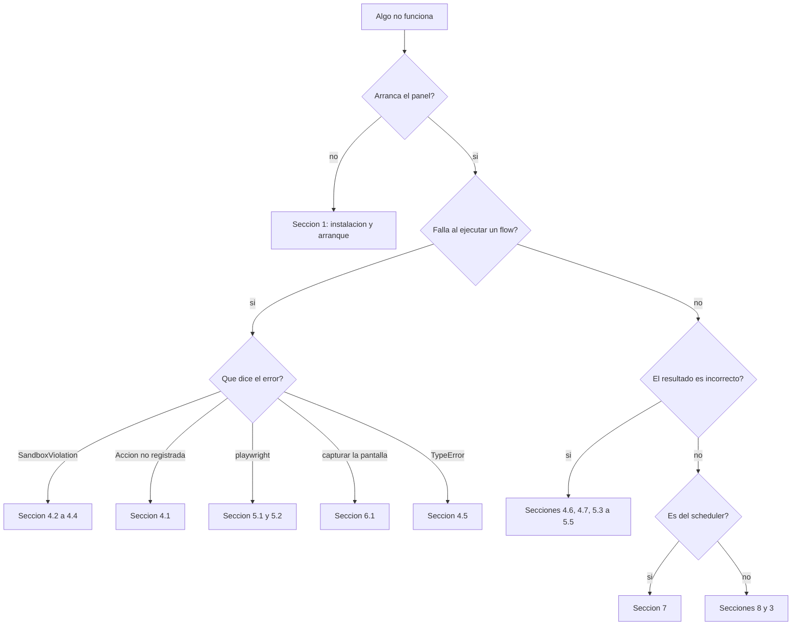

# 14 · Solución de problemas

> Guía práctica. Cada entrada sigue el mismo formato: **síntoma → causa → diagnóstico →
> solución → archivos → riesgo de aplicar la solución**. Los casos marcados
> **`VERIFICADO`** se reprodujeron durante este análisis.

---

## Índice de síntomas

| Área | Casos |
|---|---|
| [Instalación y arranque](#1-instalación-y-arranque) | 1.1 – 1.6 |
| [CLI](#2-cli) | 2.1 – 2.2 |
| [Panel](#3-panel-y-api) | 3.1 – 3.5 |
| [Ejecución de flows](#4-ejecución-de-flows) | 4.1 – 4.8 |
| [Navegador y web](#5-navegador-y-familia-web) | 5.1 – 5.5 |
| [Pantalla, OCR y UI](#6-pantalla-ocr-y-acciones-de-ui) | 6.1 – 6.5 |
| [Scheduler](#7-scheduler-y-tareas-programadas) | 7.1 – 7.4 |
| [Base de datos y almacenamiento](#8-base-de-datos-y-almacenamiento) | 8.1 – 8.4 |
| [Pruebas y CI](#9-pruebas-y-ci) | 9.1 – 9.4 |
| [Empaquetado](#10-empaquetado-y-binario) | 10.1 – 10.3 |

---

## 1. Instalación y arranque

### 1.1 · `ERROR: pywebview no esta instalado`, código de salida 2

- **Causa:** `automa-desktop` necesita `pywebview` y no está en el entorno. Suele ocurrir
  tras `make install`, que usa `requirements.txt` — donde `pywebview` **no está declarado**.
- **Diagnóstico:** `python -c "import webview; print(webview.__version__)"`
- **Solución:** `pip install -e ".[dev,schema]"` (instala desde `pyproject.toml`), o como
  mínimo `pip install pywebview`. Alternativa sin ventana: `automa-panel` y abrir
  `http://127.0.0.1:8787` en el navegador.
- **Archivos:** `app/desktop.py`, `pyproject.toml`, `requirements.txt`
- **Riesgo:** Ninguno.

### 1.2 · `ERROR: el servidor HTTP no respondio en 127.0.0.1:8787 tras 8s`, código 1

- **Causa:** El puerto está ocupado por otra instancia, o el servidor falló al arrancar en
  su hilo. `app/desktop.py::_start_server_in_thread` **captura y descarta** cualquier
  excepción del servidor, así que el motivo real no se ve.
- **Diagnóstico:**
  ```powershell
  netstat -ano | findstr :8787
  python -m app.server        # arranca en primer plano y muestra la traza real
  ```
- **Solución:** cerrar la otra instancia, o `automa-desktop --port 8888`.
- **Archivos:** `app/desktop.py::_wait_for_server`, `app/server.py::run_server`
- **Riesgo:** Ninguno. Cambiar el puerto no afecta a los datos.

### 1.3 · `PermissionError [WinError 5]` al escribir en `db/`

- **Causa:** El binario instalado bajo `Program Files` intenta escribir en su propio
  directorio. Era un fallo real de la v0.2.0, corregido en la v0.2.1.
- **Diagnóstico:**
  ```python
  from engine.paths import root_dir, data_dir
  print(root_dir(), data_dir())    # deben ser distintos si está congelado
  ```
- **Solución:** actualizar a ≥ 0.2.1. Si aparece en desarrollo, definir
  `AUTOMA_DATA_ROOT` a una ruta escribible.
- **Archivos:** `engine/paths.py::data_dir`, `installer/automa_entry.py`, `CHANGELOG.md`
- **Riesgo:** cambiar `AUTOMA_DATA_ROOT` **mueve la base de datos**: el histórico anterior
  deja de verse. Copie `db/runs.db` a la ruta nueva si quiere conservarlo.

### 1.4 · `ModuleNotFoundError` al ejecutar `python -m app.server` desde otra carpeta

- **Causa:** El paquete no está instalado y no se ejecuta desde la raíz del repositorio.
- **Diagnóstico:** `python -c "import engine; print(engine.__file__)"`
- **Solución:** `pip install -e .`, o ejecutar desde la raíz.
- **Archivos:** `pyproject.toml`, `[tool.hatch.build.targets.wheel]`
- **Riesgo:** Ninguno.

### 1.5 · `make install` deja el entorno incompleto

- **Causa:** `requirements.txt` declara seis paquetes y le faltan `pyperclip`,
  `PyGetWindow` y `pywebview`. **VERIFICADO** comparando ambos manifiestos.
- **Diagnóstico:**
  ```bash
  python -c "import pyperclip, pygetwindow, webview"   # ImportError si falta alguno
  ```
- **Solución:** usar `make install-dev` o `make sync`, que instalan desde `pyproject.toml`.
- **Archivos:** `requirements.txt`, `pyproject.toml`, `Makefile`
- **Riesgo:** Ninguno.

### 1.6 · SmartScreen bloquea el instalador

- **Causa:** El `.exe` **no está firmado**: `codesign_identity=None` en `automa.spec`.
- **Diagnóstico:** el aviso de Windows lo dice.
- **Solución:** «Más información» → «Ejecutar de todas formas», **tras verificar** que el
  archivo procede de la página oficial de releases del repositorio.
- **Archivos:** `installer/automa.spec`, `installer/Automa.iss`
- **Riesgo:** saltarse SmartScreen es un riesgo real si el origen no es el oficial.
  Verifique la URL antes.

---

## 2. CLI

### 2.1 · `UnicodeEncodeError: 'charmap' codec can't encode character '\u2192'` **`VERIFICADO`**

- **Síntoma:**
  ```text
  $ python -m engine.runner list
  UnicodeEncodeError: 'charmap' codec can't encode character '\u2192' in position 6042
  ```
- **Causa:** `engine/runner.py::main` hace
  `print(json.dumps(..., ensure_ascii=False, indent=2))`. Varios manifests contienen `→` y
  otros caracteres no representables en la página de códigos `cp1252` de la consola de
  Windows. Afecta a `list` **y** a `run`.
- **Detalle importante:** con `run`, **el flow se ejecuta completo y correctamente** —la
  corrida queda persistida y el reporte escrito—. El error salta *después*, solo al volcar
  el JSON. No se pierde trabajo, pero el código de salida es de error.
- **Diagnóstico:** `python -c "import sys; print(sys.stdout.encoding)"` → si dice `cp1252`,
  es este caso.
- **Solución:**
  ```powershell
  $env:PYTHONIOENCODING = "utf-8"; python -m engine.runner list      # PowerShell
  ```
  ```bash
  PYTHONIOENCODING=utf-8 python -m engine.runner list                 # Git Bash
  ```
  **VERIFICADO**: con la variable, el comando devuelve el JSON completo sin error.
- **Archivos:** `engine/runner.py::main`, líneas 39 y 41
- **Riesgo:** Ninguno. `PYTHONIOENCODING` solo afecta a la codificación de la salida.
- **Nota:** el panel HTTP **no** sufre este problema: escribe bytes UTF-8 a un socket.

### 2.2 · `automa: command not found`

- **Causa:** El paquete no está instalado, o el `Scripts/` del entorno virtual no está en
  el PATH.
- **Diagnóstico:** `pip show automa-pc`
- **Solución:** activar el entorno virtual, o usar la forma sin instalar:
  `python -m engine.runner …`, `python -m app.server`.
- **Archivos:** `pyproject.toml`, `[project.scripts]`
- **Riesgo:** Ninguno.

---

## 3. Panel y API

### 3.1 · `401 no autorizado: Host no loopback`

- **Causa:** Se accede al panel con un `Host` distinto de `127.0.0.1`, `localhost`, `::1`
  o `[::1]`, y no hay `AUTOMA_PANEL_TOKEN` definido. Ocurre típicamente al poner un reverse
  proxy delante, o al acceder por el nombre de la máquina.
- **Diagnóstico:** revise la cabecera `Host` de la petición.
- **Solución:** definir `AUTOMA_PANEL_TOKEN` y enviar `X-Automa-Token` en cada mutación.
- **Archivos:** `app/server.py::_authorize_mutation`
- **Riesgo:** **Medio.** Exponer el panel fuera de loopback abre todas las lecturas, que
  **no** exigen token en ningún caso: `GET /api/runs` devuelve el contexto completo de cada
  corrida. Ver [11 · Seguridad](11-security.md).

### 3.2 · `401 Origin '…' no coincide con 'http://127.0.0.1:8787'`

- **Causa:** Una petición cross-origin. Es exactamente el ataque que la defensa cierra: una
  web maliciosa haciendo `fetch` contra el panel local.
- **Diagnóstico:** si la petición la hizo usted desde otra página, es un falso positivo; si
  no, alguien intentó algo.
- **Solución:** usar el panel desde su propia URL, o el CLI, o `curl` (que no envía
  `Origin`).
- **Archivos:** `app/server.py::_authorize_mutation`
- **Riesgo:** Ninguno al usar la vía correcta. **No desactive esta comprobación.**

### 3.3 · `401 token inválido o AUTOMA_WEBHOOK_TOKEN no configurado`

- **Causa:** El webhook está **deshabilitado por defecto**. Sin la variable, responde `401`
  siempre.
- **Diagnóstico:** `python -c "import os; print(bool(os.environ.get('AUTOMA_WEBHOOK_TOKEN')))"`
- **Solución:** definir la variable en el entorno del panel —o la clave en
  `secrets/secrets.json`— y **reiniciar el panel**. Genere el valor con
  `python -c "import secrets; print(secrets.token_urlsafe(32))"`.
- **Archivos:** `app/server.py::_check_webhook_token`, `engine/secrets.py`
- **Riesgo:** **Medio.** Habilitar el webhook abre una vía de ejecución de flows. Si lo
  expone más allá de localhost, póngalo detrás de un reverse proxy con TLS, como advierte
  el `README.md`.

### 3.4 · `400 folder inválido`

- **Causa:** El segmento de la URL no pasa `_FOLDER_RE = ^[A-Za-z0-9_\-]{1,64}$`. Contiene
  un punto, una barra, un espacio o un carácter no ASCII.
- **Diagnóstico:** compare el nombre con la carpeta real en `flows/`.
- **Solución:** usar el nombre exacto de la carpeta.
- **Archivos:** `app/server.py::_safe_folder`
- **Riesgo:** Ninguno. **No relaje esta expresión regular**: es la primera línea de defensa
  contra path traversal.

### 3.5 · `415 Extensión no servida` en `/file`

- **Causa:** `/file` bloquea `.html`, `.htm`, `.xhtml`, `.xml`, `.svg`, `.js`, `.mjs` y
  `.css` para cerrar XSS reflejado desde el mismo origen.
- **Diagnóstico:** mire la extensión del archivo pedido.
- **Solución:** abra el archivo directamente desde el disco. Los `.png`, `.json`, `.csv`,
  `.md`, `.log` y `.jsonl` sí se sirven.
- **Archivos:** `app/server.py::do_GET`
- **Riesgo:** **Alto si se quita el control.** Servir HTML propio desde el mismo origen del
  panel permitiría ejecutar JavaScript con acceso a la API.

---

## 4. Ejecución de flows

### 4.1 · `FlowExecutionError: Acción no registrada: <nombre>`

- **Causa:** El manifest usa una acción que no está en `_BUILT_IN_ACTIONS` ni en los entry
  points instalados. Casi siempre, un error tipográfico.
- **Diagnóstico:**
  ```bash
  python scripts/validate_project.py     # lo detecta antes de ejecutar
  python -c "from engine.action_registry import ACTION_REGISTRY; print(sorted(ACTION_REGISTRY.keys()))"
  ```
- **Solución:** corregir el nombre, o registrar la acción.
- **Archivos:** `engine/action_registry.py`, el `manifest.json` del flow
- **Riesgo:** Ninguno.

### 4.2 · `SandboxViolation: Acción 'X' bloqueada por allowed_actions del manifest`

- **Causa:** El paso usa una acción que la política del propio flow no permite.
- **Diagnóstico:** `validate_project.py` **también lo detecta**: su comprobación 4 verifica
  la coherencia entre pasos y `allowed_actions`.
- **Solución:** añadir la acción a `allowed_actions`, **entendiendo lo que se amplía**.
- **Archivos:** `engine/sandbox.py::assert_action_allowed`, el manifest
- **Riesgo:** **Medio.** Ampliar la lista amplía lo que el flow puede hacer sobre el equipo.

### 4.3 · `SandboxViolation: Ruta fuera de allowed_paths: …`

- **Causa:** Un parámetro cuya clave contiene `path`, `destination`, `source`, `output` o
  `file` resuelve a una ruta fuera de las bases declaradas.
- **Diagnóstico:** el mensaje incluye la ruta y las bases. Compruebe que la ruta esté
  resuelta y sea relativa al directorio de trabajo esperado.
- **Solución:** corregir la ruta del manifest, o añadir la base a `allowed_paths`.
- **Archivos:** `engine/sandbox.py::assert_paths_allowed`
- **Riesgo:** **Medio.** Ampliar `allowed_paths` amplía dónde puede escribir el flow.
- **Aviso:** la detección es **por nombre de clave**. Un parámetro llamado `target` o
  `command` que contenga una ruta **no se comprueba**. No confíe en `allowed_paths` para
  acotar un flow de navegador.

### 4.4 · `SandboxViolation: Faltan variables de entorno requeridas por el flow: X`

- **Causa:** `required_secrets` declara una variable que no está en `os.environ`, o está
  vacía. El flow **no arranca**.
- **Diagnóstico:** `python -c "import os; print(os.environ.get('X'))"`
- **Solución:** definir la variable **en el entorno**, no solo en `secrets/secrets.json`.
- **Archivos:** `engine/sandbox.py::check_required_secrets`
- **Riesgo:** Ninguno.
- **Aviso importante:** `check_required_secrets` lee **solo `os.environ`**, no
  `engine.secrets.get_secret`. Un secreto que viva únicamente en `secrets/secrets.json`
  **no satisface** el requisito. Es una inconsistencia conocida entre dos mecanismos que se
  presentan como equivalentes.

### 4.5 · `TypeError: X() got an unexpected keyword argument 'Y'` o falta un argumento

- **Causa:** Los `params` del manifest no coinciden con la firma de la acción. **Ningún
  validador comprueba esto**: el manifest pasa la CI y falla en ejecución.
- **Diagnóstico:**
  ```python
  import inspect
  from engine.action_registry import ACTION_REGISTRY
  print(inspect.signature(ACTION_REGISTRY.get('screen.capture_screenshot')))
  ```
- **Solución:** corregir los `params`. Consulte [05 · Referencia técnica](05-technical-reference.md).
- **Archivos:** el manifest, `actions/*.py`
- **Riesgo:** Ninguno.

### 4.6 · Un `{{ placeholder }}` llega literal a la acción

- **Síntoma:** un archivo llamado `reporte_{{ nombre }}.json`, o un `TypeError` por recibir
  la cadena `"{{ threshold }}"` donde se esperaba un número.
- **Causa:** La clave no existe en el contexto resuelto. `render_value` **deja literal**
  lo que no puede resolver, a propósito.
- **Causa más frecuente:** existe un `configs/<carpeta>.json` guardado desde el panel que
  **oculta por completo** el `context.example.json`. Si el flow se actualizó y añadió
  claves, el archivo de config no las tiene.
- **Diagnóstico:**
  ```python
  from pathlib import Path
  from engine.loader import FlowLoader
  print(FlowLoader.load_context(Path('flows/23_web_change_detector')))
  ```
- **Solución:** añadir la clave al contexto en uso, o **borrar `configs/<carpeta>.json`**
  para que vuelva a leerse el ejemplo del flow.
- **Archivos:** `engine/loader.py::load_context`, `engine/template.py::render_value`
- **Riesgo:** **Bajo-medio.** Borrar el archivo de config **pierde la configuración
  personalizada** del flow. Cópiela antes.

### 4.7 · Un paso aparece como `skipped` y esperaba que se ejecutara

- **Causa:** Su `when` no se cumplió. Es comportamiento normal, no un error: el registro
  incluye `result: {"reason": "condition_not_met"}`.
- **Diagnóstico:** mire el valor real de la ruta consultada en el contexto de la corrida
  (pestaña Histórico → detalle → `<details>` del contexto).
- **Solución:** revisar la condición. Recuerde que `contains` **no distingue mayúsculas**,
  que `in` exige que `value` sea una lista, y que `get_path` **no soporta índices de
  lista**.
- **Archivos:** `engine/conditions.py`, el manifest
- **Riesgo:** Ninguno.

### 4.8 · Un flow con transición `on: "failure"` termina en `failed` igualmente

- **Causa:** La transición apunta al **mismo paso** que ya venía a continuación por orden.
  El motor compara `recovery_next != self._default_next(step.id)` y, si coinciden, no lo
  considera una rama de recuperación.
- **Diagnóstico:** compare el `next` de la transición con el paso siguiente del array.
- **Solución:** apuntar la transición de fallo a un paso **distinto** del siguiente por
  defecto.
- **Archivos:** `engine/orchestrator.py::run`, bloque de recuperación
- **Riesgo:** Ninguno.

---

## 5. Navegador y familia web

### 5.1 · `RuntimeError: playwright no está instalado`

- **Causa:** `playwright` **no está declarado** en `pyproject.toml` ni en
  `requirements.txt`, pero nueve flows (02, 07, 21–27) lo necesitan.
- **Diagnóstico:** `python -c "import playwright; print(playwright.__file__)"`
- **Solución:**
  ```bash
  pip install playwright
  python -m playwright install chromium
  ```
- **Archivos:** `actions/browser_capture.py`, `browser_form.py`, `browser_extract.py`
- **Riesgo:** Ninguno. Descarga ~150 MB de navegador.

### 5.2 · `Executable doesn't exist at …ms-playwright…`

- **Causa:** El paquete está pero falta el navegador descargado.
- **Diagnóstico:** el mensaje de Playwright lo indica.
- **Solución:** `python -m playwright install chromium`
- **Archivos:** —
- **Riesgo:** Ninguno.

### 5.3 · El flow 23 no detecta un cambio que sí ocurrió

- **Causas posibles, en orden de probabilidad:**
  1. **Es la primera corrida.** `apply_tracking` devuelve `first_run: true` y **nunca**
     reporta cambio: establece la línea base. Es intencional, evita una alerta espuria.
  2. **El archivo de tracking se borró.** `data/web_watch/` está en `.gitignore`. Un
     `git clean -xdf` lo elimina y la próxima corrida vuelve a ser `first_run`.
  3. **El archivo estaba corrupto.** `apply_tracking` trata un JSON ilegible como
     inexistente y **reinicia la línea base en silencio**, sin declararlo.
  4. **El cambio no afecta al texto normalizado.** `normalize_text` colapsa espacios y
     líneas vacías: un cambio de espaciado o de un atributo HTML no altera el SHA-256.
  5. **Una corrida anterior falló después del tracking.** El tracking se escribe **antes**
     de devolver el resultado: si un paso posterior falla, la línea base ya se actualizó.
- **Diagnóstico:**
  ```bash
  cat data/web_watch/demo_page.json     # ver watch_value y checked_at
  ```
- **Solución:** correr dos veces (la primera es la base). Para forzar una base nueva, borre
  el archivo de tracking.
- **Archivos:** `actions/browser_extract.py::apply_tracking`, `normalize_text`
- **Riesgo:** **Medio.** Borrar el archivo de tracking **pierde la referencia anterior**:
  la próxima corrida no detectará el cambio que estaba vigilando.

### 5.4 · El flow 07 repite un registro del seed

- **Causa:** `data/seeds/.used_indices.json` se borró, o el ciclo se agotó y se reinició
  solo (el resultado lo declara con `cycle_resetted: true`).
- **Diagnóstico:**
  ```bash
  python -c "import json;d=json.load(open('data/seeds/.used_indices.json'));print(d['used_count'],'/',d['total_in_dataset'])"
  ```
- **Solución:** ninguna necesaria si `cycle_resetted` es `true`. Si el archivo se borró, la
  memoria se perdió.
- **Archivos:** `actions/browser_form.py::_pick_record`
- **Riesgo:** Ninguno.
- **Nota:** el registro se marca como usado **antes** de intentar el llenado. Si el
  navegador falla, ese registro se pierde para el ciclo.

### 5.5 · El flow 26 lee un valor numérico incorrecto

- **Causa:** La heurística de `parse_number`. Con un solo separador y **exactamente tres
  dígitos detrás**, se asume separador de miles: `"1.234"` se interpreta como `1234.0`, no
  como `1.234`.
- **Diagnóstico:**
  ```python
  from actions.browser_extract import parse_number
  print(parse_number("1.234"))   # 1234.0
  ```
- **Solución:** ninguna en el código actual. Ajuste el `threshold` sabiendo cómo se parsea,
  o elija un selector cuyo formato no sea ambiguo.
- **Archivos:** `actions/browser_extract.py::parse_number`
- **Riesgo:** Ninguno al ajustar el umbral. Cambiar la heurística afectaría a todos los
  valores ya vigilados.

---

## 6. Pantalla, OCR y acciones de UI

### 6.1 · `RuntimeError: No fue posible capturar la pantalla`

- **Causa:** Fallaron **las dos** estrategias, `mss` y `Pillow`. Casi siempre por no haber
  escritorio gráfico: sesión SSH, contenedor, servicio sin sesión interactiva.
- **Diagnóstico:** `python -c "import mss; print(mss.mss().monitors)"`
- **Solución:** ejecutar en una sesión Windows interactiva.
- **Archivos:** `actions/screen.py::capture_screenshot`
- **Riesgo:** Ninguno.

### 6.2 · El OCR devuelve `status: "unavailable"` y `matches: []`

- **Causa:** Falta `pytesseract` (`reason: pytesseract_missing`) o el binario `tesseract`
  (`reason: tesseract_binary_missing`). **El flow no falla**: es una degradación
  deliberada.
- **Diagnóstico:**
  ```bash
  tesseract --version
  python -c "from plugins.analyzers.ocr_image_analyzer import OCRImageAnalyzer as O; print(O._tesseract_binary_available())"
  ```
- **Solución:** Windows `choco install tesseract` o el instalador de UB Mannheim; Linux
  `apt-get install tesseract-ocr`; macOS `brew install tesseract`. El analizador busca
  además en `C:/Program Files/Tesseract-OCR/tesseract.exe` y su variante `(x86)`, así que
  no hace falta tocar el PATH.
- **Archivos:** `plugins/analyzers/ocr_image_analyzer.py`
- **Riesgo:** Ninguno.

### 6.3 · `RuntimeError: No hay ventana activa identificable`

- **Causa:** `pygetwindow.getActiveWindow()` devolvió `None`. Sesión sin foco, o el flow se
  disparó desde el scheduler sin ventana en primer plano.
- **Diagnóstico:** `python -c "import pygetwindow as gw; print(gw.getActiveWindow())"`
- **Solución:** ejecutar el flow con una ventana en foco. Para uso programado, prefiera
  `screen.capture_screenshot` (escritorio completo).
- **Archivos:** `actions/screen.py::capture_active_window`
- **Riesgo:** Ninguno.
- **Nota:** `capture_region` solo trabaja sobre el **monitor primario**
  (`sct.monitors[1]`). Una ventana en un segundo monitor daría un recorte incorrecto.
  `REQUIERE VALIDACIÓN`.

### 6.4 · `RuntimeError: pyautogui no está disponible o el entorno no permite control de UI`

- **Causa:** Falta `pyautogui`, o el entorno no permite control de teclado y ratón.
- **Diagnóstico:** `python -c "import pyautogui; print(pyautogui.size())"`
- **Solución:** `pip install pyautogui` y ejecutar en un escritorio real. Para probar sin
  efectos, ponga `"dry_run": true` en el contexto del flow.
- **Archivos:** `actions/ui.py::_import_pyautogui`
- **Riesgo:** **Alto al quitar `dry_run`.** Estas acciones mueven teclado y ratón de verdad
  sobre su sesión. Pruebe siempre primero en `dry_run`.

### 6.5 · `ValueError: launch_process: shell=True está deshabilitado por seguridad`

- **Causa:** El manifest pasa `"shell": true`. Está prohibido a propósito para cerrar
  CWE-78.
- **Diagnóstico:** busque `shell` en los `params` del paso.
- **Solución:** quitar el parámetro y pasar el comando como cadena tokenizable por `shlex`.
- **Archivos:** `actions/ui.py::launch_process`
- **Riesgo:** **Alto si se reactiva.** No lo reactive: el control existe por una razón.
- **Nota Windows:** `shlex` usa reglas POSIX. Una ruta con contrabarras
  (`C:\Users\ejemplo`) puede tokenizarse mal. Use barras normales.

---

## 7. Scheduler y tareas programadas

### 7.1 · Una tarea programada nunca se ejecuta

- **Causas posibles:**
  1. `enabled` está a `0`.
  2. `next_run_at` es `NULL`.
  3. **Hay un lock huérfano** en `run_locks` para esa carpeta.
  4. No hay ningún proceso con scheduler vivo (el panel cerrado y sin `automa scheduler`).
  5. El cron apunta a un momento distinto del esperado: **`0` es lunes, no domingo**, y la
     hora es **UTC**.
- **Diagnóstico:**
  ```bash
  sqlite3 db/runs.db "SELECT folder, enabled, interval_seconds, cron_expression, next_run_at, last_run_at FROM schedules;"
  sqlite3 db/runs.db "SELECT * FROM run_locks;"
  ```
  ```python
  from engine.cron import next_after
  from datetime import datetime, timezone
  print(next_after('0 9 * * 1', datetime.now(timezone.utc)))   # ¿es el día que espera?
  ```
- **Solución:** habilitar desde el panel; liberar el lock; arrancar el panel o
  `automa scheduler --interval 2`; corregir la expresión cron.
- **Archivos:** `engine/scheduler.py`, `engine/cron.py`, `engine/database.py`
- **Riesgo:** liberar un lock **mientras la corrida sigue viva** permitiría dos ejecuciones
  en paralelo. Compruebe antes que no haya una corrida en `running`.

### 7.2 · Lock huérfano tras matar el proceso

- **Causa:** `_run_job` libera el lock en un `finally`, pero matar el proceso salta ese
  bloque. **No hay liberación automática al arrancar.**
- **Diagnóstico:**
  ```bash
  sqlite3 db/runs.db "SELECT * FROM run_locks;"
  sqlite3 db/runs.db "SELECT run_id, status FROM runs WHERE status='running';"
  ```
- **Solución:**
  ```python
  from engine.database import force_release_lock
  force_release_lock("05_system_healthcheck")
  ```
- **Archivos:** `engine/database.py::force_release_lock`, `RUNBOOK.md`
- **Riesgo:** **Medio.** Si la corrida seguía viva, se abre la puerta a una ejecución
  paralela. Verifique primero.

### 7.3 · Una tarea programada falla siempre y nadie avisa

- **Causa:** `SchedulerService._run_job` captura toda excepción con `pass`, y llama a
  `mark_schedule_run` **después** del `except`. La tarea reprograma su siguiente ejecución
  con normalidad aunque haya fallado.
- **Diagnóstico:**
  ```bash
  sqlite3 db/runs.db "SELECT flow_id, status, COUNT(*) FROM runs
                      WHERE created_at > date('now','-7 day') GROUP BY flow_id, status;"
  ```
- **Solución:** no hay ninguna en el sistema. Revise el histórico periódicamente. Como
  paliativo, añada un paso `notify.send` con transición `on: "failure"` al final del flow.
- **Archivos:** `engine/scheduler.py::_run_job`
- **Riesgo:** Ninguno al añadir la notificación.

### 7.4 · Dos schedulers corriendo a la vez

- **Causa:** El panel arranca un scheduler **al importar `app.server`**, y además se lanzó
  `automa scheduler`.
- **Diagnóstico:** cuente los procesos Python vivos.
- **Solución:** ejecute uno de los dos, no ambos.
- **Archivos:** `app/server.py` (líneas de módulo), `engine/runner.py`
- **Riesgo:** **Bajo.** La tabla `run_locks` impide que el mismo flow corra dos veces desde
  el scheduler. Pero **el lock no cubre las rutas del panel**: `POST /api/run` sí permite
  duplicados.

---

## 8. Base de datos y almacenamiento

### 8.1 · `sqlite3.OperationalError: database is locked`

- **Causa:** Dos escrituras simultáneas. El repositorio **no configura**
  `PRAGMA journal_mode=WAL` ni `busy_timeout`.
- **Diagnóstico:** ocurre con corridas en paralelo desde el panel más el scheduler.
- **Solución:** reintentar. No lance el mismo flow varias veces en paralelo.
- **Archivos:** `engine/database.py::connect`
- **Riesgo:** Ninguno al reintentar.

### 8.2 · Una corrida queda para siempre en `running`

- **Causa:** El proceso murió a mitad. Todos los hilos son *daemon*: cerrar la ventana los
  mata sin esperar. **No hay detección de corridas huérfanas.**
- **Diagnóstico:**
  ```bash
  sqlite3 db/runs.db "SELECT run_id, flow_id, started_at FROM runs WHERE status='running';"
  ```
- **Solución:** corregir a mano si molesta en el panel:
  ```sql
  UPDATE runs SET status='failed',
    error_json='{"message":"proceso interrumpido"}'
    WHERE status='running' AND started_at < datetime('now','-1 hour');
  ```
- **Archivos:** `engine/orchestrator.py`
- **Riesgo:** **Medio.** Ese `UPDATE` marcaría como fallida una corrida **que siguiera
  viva**. Compruebe que no haya ningún proceso ejecutándola antes.

### 8.3 · `db/`, `logs/`, `state/` y `output/` crecen sin control

- **Causa:** **No existe ninguna rutina de retención.** Verificado buscando `VACUUM`,
  `DELETE FROM runs` y `retention` en todo el código.
- **Diagnóstico:**
  ```bash
  du -sh db/ logs/ state/ output/
  sqlite3 db/runs.db "SELECT COUNT(*) FROM runs;"
  ```
- **Solución:** purga manual.
  ```bash
  find logs/ -name "*.jsonl" -mtime +30 -delete
  find state/ -name "*.json"  -mtime +30 -delete
  sqlite3 db/runs.db "DELETE FROM runs WHERE created_at < date('now','-90 day');"
  sqlite3 db/runs.db "VACUUM;"
  ```
- **Archivos:** `engine/database.py`, `engine/logger.py`, `engine/state_store.py`
- **Riesgo:** **Alto y en dos frentes.**
  1. **No hay claves foráneas ni `ON DELETE CASCADE`.** Borrar de `runs` deja huérfanas las
     filas de `steps` y `events`. Bórrelas también, o el dashboard de métricas seguirá
     contándolas.
  2. **Nunca borre `data/seeds/.used_indices.json` ni `data/web_watch/*.json`.** No son
     residuo: son la memoria de los flows 07, 23 y 26.

### 8.4 · El histórico desapareció tras actualizar o mover la instalación

- **Causa:** `data_dir()` cambió. En desarrollo es la raíz del repositorio; en el binario
  es `%LOCALAPPDATA%\Automa`; con `AUTOMA_DATA_ROOT` es lo que diga esa variable.
- **Diagnóstico:**
  ```python
  from engine.paths import data_dir
  print(data_dir())
  ```
- **Solución:** copiar `runs.db` de la ubicación antigua a la nueva.
- **Archivos:** `engine/paths.py::data_dir`
- **Riesgo:** **Medio.** Sobrescribir un `runs.db` existente pierde su histórico. Haga
  copia primero.

---

## 9. Pruebas y CI

### 9.1 · `FAIL Required test coverage of 54% not reached`

- **Causa:** La cobertura bajó del umbral configurado en `pyproject.toml`.
- **Situación real medida:** la cobertura oscila entre **58,9 % y 60,0 %** entre corridas
  del mismo commit, `INFERENCIA` por el hilo de scheduler que se arranca al importar
  `app.server`. El margen sobre el gate es de menos de 5 puntos.
- **Diagnóstico:** `python -m pytest` y mire la columna `Missing` del módulo que bajó.
- **Solución:** añadir pruebas. **No baje el umbral.**
- **Archivos:** `pyproject.toml`, `[tool.pytest.ini_options]`
- **Riesgo:** bajar el umbral degrada permanentemente el gate.

### 9.2 · `--collect-only` falla con el error de cobertura

- **Causa:** `addopts` incluye `--cov-fail-under=54` y se aplica también al recuento.
- **Diagnóstico:** el error aparece justo tras la tabla de cobertura.
- **Solución:** `python -m pytest --collect-only -q --no-cov`
- **Archivos:** `pyproject.toml`
- **Riesgo:** Ninguno.

### 9.3 · Tras `python scripts/smoke_test.py`, `git status` marca un archivo modificado

- **Causa:** El smoke test llama a
  `set_flow_config('03_folder_inventory', {'path_override': 'data/inbox'})`, que
  **reescribe el archivo versionado** `configs/03_folder_inventory.json`. **VERIFICADO**
  durante este análisis.
- **Diagnóstico:** `git status --porcelain` y `git diff configs/`
- **Solución:** `git checkout -- configs/03_folder_inventory.json`
- **Archivos:** `scripts/smoke_test.py`, `engine/database.py::set_flow_config`
- **Riesgo:** Ninguno. **Pero revise siempre `git status` antes de confirmar** tras
  ejecutar el smoke test.

### 9.4 · La CI falla en `markdown-docs` por un enlace roto

- **Causa:** El verificador recorre **todos** los `.md` del repositorio (excluyendo
  `node_modules`, `.git`, `output`, `state`, `logs`) y falla si un enlace relativo no
  resuelve.
- **Diagnóstico:** el log del job lista hasta 50 enlaces rotos con archivo y posición.
- **Solución:** corregir la ruta relativa.
- **Archivos:** `.github/workflows/markdown-docs.yml`
- **Riesgo:** Ninguno.
- **Aviso:** el workflow solo se dispara en `pull_request` con `paths: '**/*.md'`. **Un
  push directo a `main` con un enlace roto no lo detecta.**

---

## 10. Empaquetado y binario

### 10.1 · `ModuleNotFoundError: No module named 'actions.browser_extract'` en el `.exe`

- **Causa:** `installer/automa.spec` **no lista `actions.browser_extract`** en
  `hiddenimports`, y el registro lo carga con `import_module` dinámico, que PyInstaller no
  rastrea. **VERIFICADO** en el archivo; `REQUIERE VALIDACIÓN` el efecto, porque no se
  compiló.
- **Afectaría a:** los siete flows de la familia web (21–27).
- **Diagnóstico:** ejecutar el flow 21 desde el binario instalado.
- **Solución propuesta** —no aplicada, este documento es informativo—: añadir
  `"actions.browser_extract"` a la lista de `hiddenimports`.
- **Archivos:** `installer/automa.spec`
- **Riesgo:** Ninguno. Añadir un `hiddenimport` es aditivo.

### 10.2 · Los flows de navegador no funcionan en el binario aunque el módulo esté

- **Causa:** `playwright` y el Chromium descargado **no se empaquetan**. No aparecen ni en
  `datas` ni en `hiddenimports` de `automa.spec`. `INFERENCIA` coherente con el tamaño del
  instalador.
- **Diagnóstico:** ejecutar el flow 02 desde el binario.
- **Solución:** ninguna sin rediseñar el empaquetado.
- **Archivos:** `installer/automa.spec`
- **Riesgo:** —

### 10.3 · Tras desinstalar, quedan datos en el disco

- **Causa:** El desinstalador de Inno Setup borra `{app}`, pero los datos viven en
  `%LOCALAPPDATA%\Automa` por diseño (`engine/paths.py::data_dir` en modo congelado).
  `INFERENCIA`.
- **Diagnóstico:** revise `%LOCALAPPDATA%\Automa` tras desinstalar.
- **Solución:** borrar la carpeta a mano.
- **Archivos:** `engine/paths.py::data_dir`, `installer/Automa.iss`
- **Riesgo:** **Alto.** Esa carpeta contiene el histórico completo y **todas las capturas
  de pantalla**, que pueden ser sensibles. Bórrela de forma segura si el equipo cambia de
  manos; pero recuerde que el borrado es irreversible.

---

## 11. Diagnóstico general: por dónde empezar



**Lo que el árbol muestra:** el orden de descarte más rápido, del arranque al resultado.
**Lo que no muestra:** los tres comandos que resuelven la mayoría de los diagnósticos y
conviene ejecutar antes que nada:

```bash
python scripts/validate_project.py                 # ¿el catálogo está sano?
curl http://127.0.0.1:8787/healthz                 # ¿el panel responde?
sqlite3 db/runs.db "SELECT run_id, flow_id, status, error_json FROM runs
                    ORDER BY created_at DESC LIMIT 5;"    # ¿qué pasó en las últimas corridas?
```

---

**Documentos relacionados:**
[02 · Instalación](02-installation-and-execution.md) ·
[10 · Configuración](10-configuration.md) ·
[11 · Seguridad](11-security.md) ·
[13 · Despliegue y operación](13-deployment-and-operations.md) ·
[15 · Riesgos y deuda técnica](15-risks-and-technical-debt.md)
