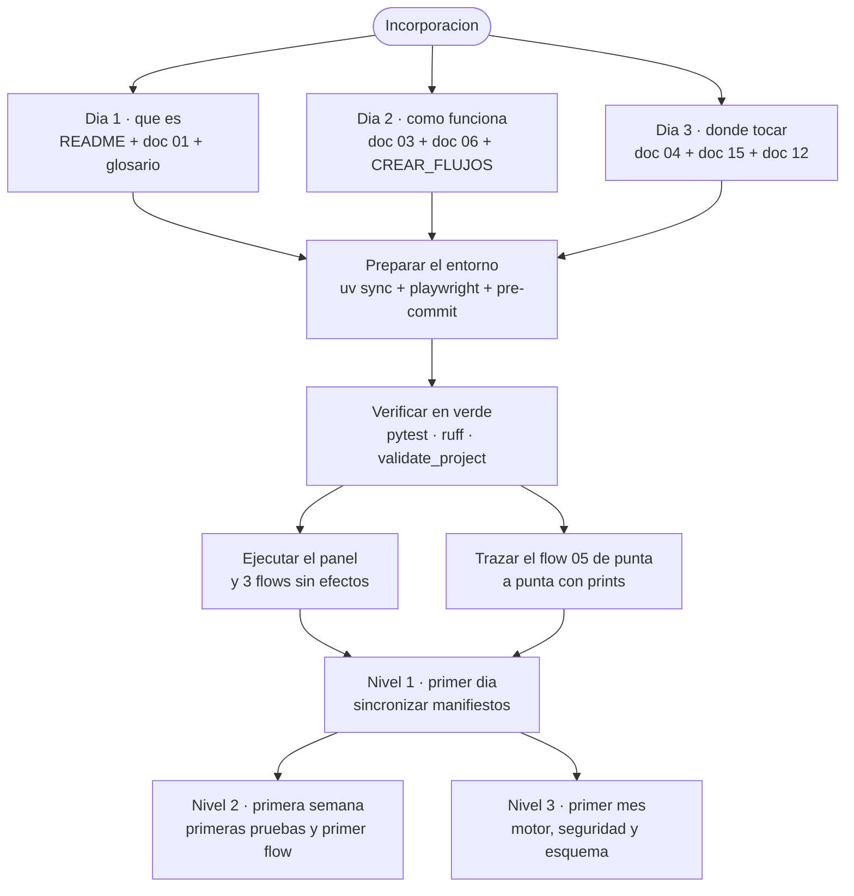

# 18 · Guía para un nuevo desarrollador

> Itinerario progresivo de incorporación. Empieza por lo que hay que leer, sigue por cómo
> preparar el entorno, y termina con tareas iniciales reales del repositorio, ordenadas por
> dificultad.

---

## 1. Qué leer primero, y en qué orden

**No lea los veinte documentos.** Este es el camino corto:

### Día 1 · Entender qué es (≈ 45 min)

| Orden | Documento | Por qué |
|---:|---|---|
| 1 | [`README.md`](../../README.md) del repositorio | El catálogo de 27 casos con una frase cada uno. La visión del producto |
| 2 | [01 · Descripción general](01-system-overview.md) | Qué resuelve, qué no hace, qué son sus límites |
| 3 | [16 · Glosario](16-glossary.md) | Los diez términos propios que se usan en todas partes: flow, manifest, acción, contexto, sandbox, tracking |
| 4 | [`docs/ARQUITECTURA.md`](../ARQUITECTURA.md) | La versión corta del diseño, escrita por el autor |

### Día 2 · Entender cómo funciona (≈ 2 h)

| Orden | Documento | Por qué |
|---:|---|---|
| 5 | [03 · Arquitectura](03-architecture.md) | Capas, patrones, concurrencia y manejo de errores, con diagramas |
| 6 | [06 · Explicación profunda](06-deep-code-explanation.md), secciones 1 a 5 | El bucle del orquestador, los placeholders, el sandbox y las condiciones, línea a línea |
| 7 | [`docs/CREAR_FLUJOS.md`](../CREAR_FLUJOS.md) | El contrato que debe cumplir un flow |

### Día 3 · Saber dónde tocar (≈ 1 h)

| Orden | Documento | Por qué |
|---:|---|---|
| 8 | [04 · Mapa del código](04-code-map.md) | Qué hay en cada archivo y su estado: activo, sin uso, muerto |
| 9 | [15 · Riesgos](15-risks-and-technical-debt.md) | Las trampas conocidas. **Léalo antes de tocar nada** |
| 10 | [12 · Pruebas y calidad](12-testing-and-quality.md) | Qué se prueba y qué no; qué se espera de su código |

**Los demás documentos son de consulta**, no de lectura seguida:
[05](05-technical-reference.md) para firmas y endpoints, [07](07-database.md) para el
esquema, [10](10-configuration.md) para configurar, [14](14-troubleshooting.md) cuando algo
falle, [19](19-traceability-matrix.md) para seguir una funcionalidad de punta a punta.

## 2. Preparar el entorno

```bash
git clone https://github.com/vladimiracunadev-create/automa-pc.git
cd automa-pc

uv sync --extra dev --extra schema        # camino recomendado
# o bien:
python -m venv .venv && .venv\Scripts\activate && pip install -e ".[dev,schema]"

python -m playwright install chromium     # necesario para los flows 02, 07 y 21-27
pre-commit install                        # engancha ruff, formato y markdownlint
```

En Windows, añada esto a su perfil de PowerShell **antes de usar el CLI**:

```powershell
$env:PYTHONIOENCODING = "utf-8"
```

Sin eso, `automa list` y `automa run` terminan con `UnicodeEncodeError`. Es un defecto real
del repositorio, no un problema de su máquina. Ver
[15 · R-06](15-risks-and-technical-debt.md).

**No use `make install`.** Usa `requirements.txt`, al que le faltan tres paquetes.

### Comprobar que quedó bien

```bash
python -m pytest                          # 150 passed
python -m ruff check .                    # All checks passed!
python scripts/validate_project.py        # {"ok": true, "flows_checked": 27, ...}
```

Si los tres pasan, está listo. Tardan unos 18 segundos en total.

## 3. Ejecutar el sistema por primera vez

```bash
automa-desktop        # ventana nativa
# o:
automa-panel          # panel HTTP en http://127.0.0.1:8787
```

**Recorrido de cinco minutos, sin efectos sobre su equipo:**

1. Pestaña **Ejecutar** → tarjeta de `05_system_healthcheck` → clic. Verá los tres pasos
   en tiempo real.
2. Pestaña **Histórico** → clic en la corrida recién hecha. Verá los pasos, sus duraciones,
   el contexto y el JSON generado.
3. Ejecute `03_folder_inventory`. Compare el resumen legible con el JSON crudo.
4. Abra `http://127.0.0.1:8787/metrics/dashboard`.
5. Ejecute `21_web_content_extract` (necesita Chromium). Apunta a un HTML local del propio
   repositorio: no sale a internet.

> ⚠️ **No ejecute todavía** los flows 08 (bloquea la sesión), 13, 14 o 20: mueven teclado y
> ratón de verdad. Cuando quiera probarlos, ponga primero `"dry_run": true` en su
> `context.example.json`.

## 4. Cómo está organizado el repositorio

```text
engine/     El motor. No se toca para añadir un caso
actions/    Las 36 operaciones. Aquí se añade cuando hace falta una nueva
flows/      Los 27 casos. Aquí se añade casi siempre
app/        Panel HTTP y ventana nativa
plugins/    Analizadores de imagen intercambiables
schemas/    El contrato JSON del manifest
scripts/    Validador, smoke test y generador de PDF
tests/      150 pruebas
data/       HTML de demo, dataset semilla, carpetas de entrada
db/ logs/ state/ output/ configs/ secrets/   Almacenes en ejecución (ignorados por git)
```

**La regla de oro del proyecto, escrita en su README:** *el sistema se construye agregando
casos, no refactorizando el motor.*

Antes de proponer un cambio en `engine/`, pregúntese si el caso se puede resolver con las
36 acciones existentes. En 27 de 27 ocasiones, la respuesta ha sido sí.

## 5. Seguir un flujo completo, de la interfaz a la persistencia

El mejor ejercicio de incorporación. Tome `05_system_healthcheck` y recorra esto:

| Paso | Archivo | Qué pasa |
|---:|---|---|
| 1 | `app/server.py::do_POST` | Llega `POST /api/run/05_system_healthcheck` |
| 2 | `app/server.py::_safe_folder` | Se valida el slug de la URL |
| 3 | `app/server.py::_authorize_mutation` | Token, o `Host`/`Origin`/`Referer` |
| 4 | `engine/orchestrator.py::__init__` | Se crea la base, se lee el manifest y el contexto |
| 5 | `engine/loader.py::load_manifest` | JSON → `FlowDefinition` |
| 6 | `engine/loader.py::load_context` | Se resuelve la primera fuente de contexto que exista |
| 7 | `engine/sandbox.py::assert_secrets_present` | Único control por corrida |
| 8 | `engine/orchestrator.py::run` | Empieza el bucle |
| 9 | `engine/template.py::render_value` | `{{ … }}` y `{now}` se sustituyen |
| 10 | `engine/sandbox.py::assert_action_allowed` | Se comprueba la acción |
| 11 | `engine/action_registry.py::get` | Se importa el módulo de la acción, la primera vez |
| 12 | `actions/system.py::snapshot_system` | Trabajo efectivo con `psutil` |
| 13 | `engine/orchestrator.py` | El resultado va al contexto con `save_as` |
| 14 | `actions/rules.py::evaluate_rules` | Se evalúan las reglas del manifest |
| 15 | `actions/filesystem.py::write_json` | Se escribe el reporte |
| 16 | `engine/database.py::insert_step` + `upsert_run` | Persistencia tras cada paso |
| 17 | `engine/logger.py::JsonlLogger.write` | Evento en archivo **y** en la tabla `events` |
| 18 | `engine/introspection.py::extract_existing_paths` | Se detectan los archivos bajo `output/` |
| 19 | `app/server.py::_run_status_payload` | El panel hace polling y ve el avance |
| 20 | `app/server.py::render_run_detail` | Se dibuja el detalle |

Ponga un `print()` en tres de esos puntos, ejecute el flow y observe el orden real. En
media hora tendrá el modelo mental completo.

## 6. Dónde añadir cada cosa

### Un caso nuevo (lo habitual)

```bash
mkdir flows/28_mi_caso
```

Tres archivos: `manifest.json`, `context.example.json` y `README.md`. Copie uno del bloque
08–20 como plantilla: **son los que traen política de sandbox declarada**.

```json
{
  "id": "mi_caso",
  "name": "Nombre legible del caso",
  "family": "sistema",
  "description": "Qué hace, en una o dos frases.",
  "allowed_actions": ["system.snapshot_system", "filesystem.write_json"],
  "allowed_paths": ["output/reports"],
  "max_runtime_seconds": 30,
  "steps": [
    {
      "id": "primer_paso",
      "action": "system.snapshot_system",
      "params": {},
      "save_as": "snapshot"
    },
    {
      "id": "guardar",
      "action": "filesystem.write_json",
      "params": {
        "path": "output/reports/mi_caso_{now}.json",
        "data": "{{ snapshot }}"
      },
      "save_as": "report"
    }
  ]
}
```

Después:

```bash
python scripts/validate_project.py                    # debe devolver ok: true, 28 flows
PYTHONIOENCODING=utf-8 python -m engine.runner run flows/28_mi_caso
```

Y **reinicie el panel**: `sync_flows` solo corre al importar `app.server`.

> **Declare siempre `allowed_actions`, `allowed_paths` y `max_runtime_seconds`**, aunque 14
> flows existentes no lo hagan. Es lo correcto y es lo que va a exigirse.
> ⚠️ **Nunca escriba `"allowed_actions": []`**: una lista vacía se interpreta como «sin
> restricción», no como «bloquear todo».

### Una acción nueva (menos frecuente)

1. Escríbala en el módulo de `actions/` que corresponda a su familia.
2. Regístrela en `engine/action_registry.py::_BUILT_IN_ACTIONS`.
3. Añádala a `pyproject.toml`, `[project.entry-points."automa.actions"]`.
4. Si carga un módulo pesado, añádala a `installer/automa.spec::hiddenimports`.
5. Escriba pruebas.

**Contrato de una acción:**

```python
def mi_accion(param_obligatorio: str, param_opcional: int = 10) -> dict[str, Any]:
    """Qué hace y por qué existe.

    Args:
        param_obligatorio: …
    Returns:
        dict serializable a JSON.
    Raises:
        RuntimeError: si falta una dependencia externa.
    """
```

Reglas no negociables:

- **Devuelve un `dict` serializable a JSON.** Va a acabar en SQLite.
- **Los parámetros son por nombre.** El motor hace `action(**rendered_params)`.
- **Si aplica una cota, decláralo en el resultado** (`truncated: True`). Nunca en silencio.
- **Si falta una dependencia externa, mensaje útil**, no un `ImportError` pelado.
- **Si toca teclado o ratón, acepta `dry_run`.**
- **Separa lo puro de lo impuro.** Es lo que permite probarla sin el mundo real. Mire
  `actions/browser_extract.py` como referencia: **91 % de cobertura sin abrir un navegador**.
- **Si un parámetro es una ruta, que su nombre contenga `path`, `output`, `file`,
  `source` o `destination`.** El sandbox detecta rutas por el nombre de la clave.

Los pasos 3 y 4 se olvidan con facilidad: los dos están hoy desincronizados en el
repositorio (ver [15 · R-01 y R-20](15-risks-and-technical-debt.md)).

### Un analizador de imagen nuevo

Implemente `plugins/analyzers/base.py::AnalyzerProtocol` (un método `analyze(image_path)`)
y regístrelo en `actions/vision.py::ANALYZERS`.

### Un endpoint nuevo del panel

En `app/server.py`, dentro de `do_GET` o `do_POST`.

> ⚠️ **Cuidado con este archivo.** 1 753 líneas con enrutado, CSS, HTML y JavaScript
> mezclados, y solo 38 % de cobertura. Si añade un POST, **debe** pasar por
> `_authorize_mutation`. Si renderiza contenido de una corrida, **debe** pasar por
> `html.escape`.

## 7. Cómo escribir pruebas

Copie el estilo de `tests/test_browser_extract.py`: es el mejor ejemplo del repositorio.

```python
def test_mi_funcion_pura():
    """Una prueba por comportamiento, con nombre que lo describa."""
    assert mi_funcion("entrada") == {"resultado": "esperado"}


def test_flow_completo(tmp_runtime, project_root):
    """tmp_runtime aísla db/, logs/, state/ y output/ en un tmp_path."""
    orch = Orchestrator(project_root / 'flows' / '05_system_healthcheck')
    state = orch.run()
    assert state['status'] == 'completed'
```

Las dos fixtures disponibles están en `tests/conftest.py`:

| Fixture | Qué hace |
|---|---|
| `tmp_runtime` | Crea los directorios de trabajo en un `tmp_path` y cambia el cwd |
| `project_root` | Devuelve la raíz del repositorio |

**Para probar algo que depende del mundo exterior**, no lo simule con `mock`: cree un
objeto falso con la misma interfaz. `test_browser_extract.py` usa una `FakePage` que imita
a Playwright y un `fetch_page` falso para el crawl. Es más legible y no se rompe al
cambiar la implementación.

**El gate de cobertura está en 54 % y la medición real ronda el 59 %.** Menos de cinco
puntos de margen: una función nueva sin pruebas puede hacer fallar la CI.

## 8. Partes que exigen especial cuidado

| Archivo | Por qué | Antes de tocarlo |
|---|---|---|
| `engine/orchestrator.py::run` | 139 líneas de bucle con siete puntos de salida. Todo el sistema depende de él | Lea [06 §1](06-deep-code-explanation.md) entera |
| `engine/template.py` | Los 27 manifests dependen de su semántica exacta | Entienda la diferencia entre placeholder exacto y embebido |
| `engine/sandbox.py` | Es la única barrera de seguridad en ejecución | Lea [11 §4](11-security.md) |
| `actions/browser_extract.py::normalize_text` | **Cambiarla invalida todos los hashes ya guardados.** El flow 23 reportaría cambios falsos | No la toque sin plan de migración |
| `app/server.py` — auth y `/file` | Cierran CSRF, path traversal y XSS. Los comentarios citan los CWE | No relaje ningún control |
| `actions/ui.py` | Mueve teclado y ratón de la máquina de quien ejecute | Respete siempre `dry_run` |
| `actions/system.py::run_powershell` | Ejecuta comandos en el equipo | No amplíe la allowlist por defecto |
| `engine/database.py::init_db` | El esquema. Sin migraciones más allá de añadir columnas | Piense en las bases existentes |
| `installer/automa.spec` | Un `hiddenimport` que falte rompe un flow **solo en el binario**, nunca en desarrollo | Ver [15 · R-01](15-risks-and-technical-debt.md) |

## 9. Convenciones que respetar

| Ámbito | Convención |
|---|---|
| Idioma | **Español** en comentarios, docstrings, descripciones de flow y mensajes de error. Identificadores en inglés |
| Estilo | `ruff` con `E,F,W,I,B,UP`; línea de 120 |
| Tipado | Anotaciones en toda función pública. `from __future__ import annotations` al inicio |
| Docstrings | Explican **por qué** existe el código y qué decisión contiene, no qué hace la línea siguiente |
| Comentarios | Solo para lo no obvio. `❌ # asigna value` · `✅ # value va vacío a propósito: …` |
| Nombres de flow | `NN_nombre_descriptivo`, número correlativo |
| Nombres de acción | `familia.verbo_objeto` |
| Fechas | Siempre UTC en ISO-8601 |
| Rutas en manifests | Relativas, con barra normal |
| Commits | Convencional: `feat(scope):`, `fix(scope):`, `docs:`, `ci(deps):` — mire `git log` |
| Antes de subir | `pytest`, `ruff check`, `validate_project.py`. Los tres en verde |

## 10. Tareas iniciales, ordenadas por dificultad

Todas son hallazgos reales del [documento 15](15-risks-and-technical-debt.md), no
ejercicios inventados.

### Nivel 1 · Primer día (< 1 h cada una)

| # | Tarea | Archivo | Aprende |
|---:|---|---|---|
| 1 | Sincronizar `requirements.txt` con `pyproject.toml` (faltan 3 paquetes) | `requirements.txt` | Cómo se declaran las dependencias |
| 2 | Añadir las 5 acciones que faltan en `[project.entry-points."automa.actions"]` | `pyproject.toml` | El mecanismo de extensión |
| 3 | Añadir `actions.browser_extract` a `hiddenimports` | `installer/automa.spec` | Cómo se empaqueta el producto. **Corrige el riesgo nº 1** |
| 4 | Documentar en `docs/OPERACION.md` que en el cron `0` es lunes y la hora es UTC | `docs/OPERACION.md` | El programador de horarios |

### Nivel 2 · Primera semana (medio día cada una)

| # | Tarea | Archivo | Aprende |
|---:|---|---|---|
| 5 | Prueba que verifique que `allowed_actions: []` produce política permisiva | `tests/test_loader.py` | El sandbox y un caso límite real |
| 6 | Pruebas de `_pick_record`: no repite, reinicia al agotar, marca antes de llenar | `tests/`, `actions/browser_form.py` | Separar lo puro de lo impuro |
| 7 | Prueba de `find_text_in_image` con un `matches` falso | `tests/`, `actions/vision.py` | Cómo probar sin dependencias externas |
| 8 | Reemplazar el `root_dir()` local de `catalog.py` por el de `engine.paths` | `engine/catalog.py` | La resolución de rutas y el modo empaquetado |
| 9 | Un flow nuevo que use `filesystem.move_file` (registrada, sin ningún caso) | `flows/28_*/` | El ciclo completo de crear un caso |

### Nivel 3 · Primer mes (uno a tres días cada una)

| # | Tarea | Aprende |
|---:|---|---|
| 10 | Exigir token también en los GET cuando `AUTOMA_PANEL_TOKEN` esté definido | El modelo de autorización completo |
| 11 | Regla en `validate_project.py` que exija `allowed_actions` en todo flow | Cómo se extiende el gate del proyecto |
| 12 | Mover el arranque del scheduler de las líneas de módulo a `run_server()` | Efectos secundarios de importación y su impacto en las pruebas |
| 13 | Índices sobre `runs.flow_id`, `steps.run_id` y `events.run_id` | El esquema y sus consultas |
| 14 | Unificar los dos motores de condiciones (13 operadores frente a 6) | Duplicación con consecuencias reales |
| 15 | Ramas de `_smart_summary` para los flows web y para el 07 | La capa de presentación |

### Lo que NO conviene hacer como tarea inicial

- Refactorizar `app/server.py`. Es tentador y es el archivo más grande, pero tiene 38 % de
  cobertura: cualquier cambio es arriesgado sin pruebas previas.
- Cambiar `normalize_text` o el formato de los hashes.
- Reactivar `shell=True` en `launch_process` «para que funcione un comando».
- Bajar el umbral de cobertura para que pase la CI.

## 11. Itinerario resumido



**Lo que el itinerario muestra:** tres días de lectura orientada antes de tocar nada, y una
progresión de tareas que va de los archivos de configuración al motor.

**Lo que no muestra:** que el paso más rentable es el de trazar el flow 05 con `print()`.
Media hora ahí ahorra días de leer código en frío.

## 12. Dónde preguntar

| Duda | Dónde mirar primero |
|---|---|
| «¿Qué hace esta función?» | [05 · Referencia técnica](05-technical-reference.md) |
| «¿Por qué está escrita así?» | [06 · Explicación profunda](06-deep-code-explanation.md) y los comentarios del propio código |
| «¿Dónde se guarda esto?» | [07 · Base de datos](07-database.md) |
| «Me falla X» | [14 · Solución de problemas](14-troubleshooting.md) |
| «¿Esto es un bug o es a propósito?» | [15 · Riesgos](15-risks-and-technical-debt.md) — probablemente ya está registrado |
| «¿Cómo se prueba esto?» | [12 · Pruebas y calidad](12-testing-and-quality.md) |
| «¿Dónde toco para la funcionalidad X?» | [19 · Matriz de trazabilidad](19-traceability-matrix.md) |
| Cómo contribuir | [`CONTRIBUTING.md`](../../CONTRIBUTING.md) |
| Reportar una vulnerabilidad | [`SECURITY.md`](../../SECURITY.md) |

---

**Documentos relacionados:**
[02 · Instalación](02-installation-and-execution.md) ·
[04 · Mapa del código](04-code-map.md) ·
[12 · Pruebas y calidad](12-testing-and-quality.md) ·
[15 · Riesgos](15-risks-and-technical-debt.md) ·
[19 · Matriz de trazabilidad](19-traceability-matrix.md)
